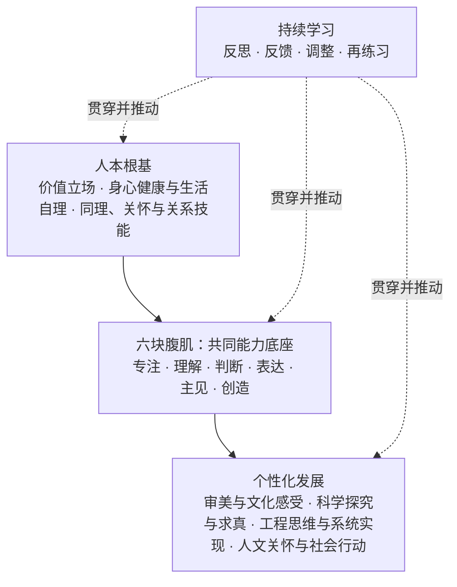

# AI 时代学生能力框架｜人本根基、六块腹肌与个性化发展

> **定位**：本文件定义 Taala / LKFJ 的学生能力总纲。它重点解释：为什么 AI 时代要特别训练六块腹肌、六块腹肌是什么，以及它们如何与人的根基、持续学习和个性化发展相互配合。

---

## 1. 核心命题

> **AI 可以外包任务，但不能外包成长。**

AI 可以生成文字、图像、代码和方案，也能加速检索、分析、表达与制作；但它不能替学生形成注意力、理解、判断、表达、方向和创造行动。恰恰因为 AI 能迅速代做许多任务，这些能力才更需要被有意识地保护和训练。

六块腹肌不是学生能力的全部，而是 AI 时代每个学生最不能外包、最应重点练习的共同能力核心。

---

## 2. 顶层结构

本体系不把所有重要事物都叫作“能力”。价值立场是方向，健康与关系是成长根基，六块腹肌是共同能力底座，持续学习是发展机制；个性化发展则是学生在共同底座上形成的优势视角与创造路径。

| 角色 | 内容 | 教育含义 |
|---|---|---|
| **人本根基** | 价值立场；身心健康与生活自理；同理、关怀与关系技能。 | 每个人都应被保障。它们不与六块腹肌竞争，而是回答学生应成为什么样的人、在怎样的状态与关系中成长。 |
| **六块腹肌** | 专注、理解、判断、表达、主见、创造。 | 每个人都应重点、长期培养的共同能力底座；是 AI 时代最不能外包的能力。 |
| **持续学习** | 反思、接受反馈、调整方法、再练习。 | 不是第七块肌肉，而是让六块能力与其他发展不断升级的成长机制。 |
| **个性化发展** | 审美与文化感受；科学探究与求真；工程思维与系统实现；人文关怀与社会行动。 | 学生在共同底座上选择长期加深的优势视角与创造路径；不等同于“选一个学科或专业”。 |

### 2.1 人本根基不等于能力清单

- **价值立场**不是“会不会”的能力，而是判断何为值得、何为不可做的规范：尊严、诚实、公平、关怀、尊重与责任。
- **身心健康与生活自理**包含可培养的能力，但其角色首先是保证学生能健康生活、稳定学习和逐步独立。
- **同理、关怀与关系技能**也包含能力，但其重点不是“把话说清”，而是理解他人、建立信任、协商冲突、给予和接受支持。

表达肌会训练沟通；主见肌会训练责任；但二者不能取代人本根基。

### 2.2 个性化发展：不是按学科分流，而是形成独特的优势方向

个性化发展不按“艺术、技术、专业、研究”等相互交叉的领域标签分类，而按学生逐步形成的**看世界、解决问题和创造价值的方式**来理解。四个方向不是互斥的专业赛道，学生可以交叉发展。

| 优势方向 | 关心的核心问题 | 与六块腹肌的边界 |
|---|---|---|
| **审美与文化感受** | 什么是有意味、有风格、有文化根基的表达？ | 创造肌保证“能够创造”；这里进一步形成品位、感受力和文化表达语言。 |
| **科学探究与求真** | 世界如何运作？什么证据能够支持结论？ | 判断肌提供基本的证据意识；这里进一步进入研究问题、实验、模型与理论。 |
| **工程思维与系统实现** | 如何在真实约束下，把复杂问题变成可靠、可运行的系统？ | 任务拆解、制作和迭代是共同底子；这里进一步强调系统、约束、可靠性与实现。 |
| **人文关怀与社会行动** | 人与社会如何更好地共同生活？ | 人本根基提供价值与关系，主见肌提供负责；这里进一步形成公共议题、组织协作和社会实践。 |

每个学生都应有接触艺术、科学、技术、社会与真实实践的机会；但无需在四个方向上平均用力，更不应过早把学生固定为某一“专业类型”。

---

## 3. 原有能力框架与六块腹肌的关系

原有三类能力仍是课程与评价的主框架。六块腹肌从其中发展而来，不是重新把全部能力改名为六块。

| 原有能力框架 | 原有与补充后的子能力 | 被高亮出的六块腹肌 |
|---|---|---|
| **自我成长力** | 情绪感知与调节；注意力与自我管理；自驱与方向感；持续学习。 | **专注肌**来自情绪、注意力和自我管理。 **主见肌**来自自驱、方向感与责任。 |
| **判断与问题力** | 深度理解与知识建构；信息与证据判断；问题定义；系统思考与任务拆解。 | **理解肌**来自深度理解与知识建构。 **判断肌**来自逻辑、证据、数据、因果和来源判断。 |
| **创造与共创力** | 创造力；表达与协作；创造性实践；社会责任。 | **表达肌**来自清楚表达、倾听、追问与转述。 **创造肌**来自创造力与创造性实践。 |

---

## 4. 六块腹肌：AI 时代最不能外包的共同能力

| 六块腹肌 | 核心功能 | 基础读写算与数字素养的落点 | AI 为什么使它更重要 |
|---|---|---|---|
| **专注肌** | 管理注意力、情绪、冲动与数字使用，保持持续投入。 | 屏幕管理、工作记忆、独立完成基础练习。 | AI 和信息流不断降低启动成本、提高即时反馈，学生更容易外包专注、忍耐和思考过程。 |
| **理解肌** | 读懂、倾听、记忆、复述，并将信息组织为自己的知识结构。 | 阅读、倾听、知识组织、语境理解。 | AI 能给摘要和结论，却不能保证学生真正理解原意、条件和知识关系。 |
| **判断肌** | 检查概念、论证、数据、因果和来源是否成立。 | 数感、数据、概率、逻辑、媒介与数字信息判断。 | AI 的错误常常流畅而自信；没有判断，学生无法分辨输出是否可靠。 |
| **表达肌** | 将想法、需求、理由和限制说清、写清，并理解他人的意思。 | 写作、口语、提问、倾听、对话。 | 人机协作的质量取决于学生能否说明目标、背景、限制与评价标准。 |
| **主见肌** | 形成价值、兴趣、方向与选择，并对过程和影响负责。 | 问题选择、数字责任、隐私、版权、署名与工具边界。 | AI 能给建议和推荐，却不能替学生决定什么值得做或承担后果。 |
| **创造肌** | 将观察、理解和判断转化为可测试的作品、方案或服务。 | 工具使用、制作、原型、测试、迭代。 | AI 能快速生成选项，但不能替学生让成果回应真实对象、经过测试并创造真实价值。 |

### 4.1 专注肌

**定义**：学生能觉察情绪、压力和注意力状态，管理冲动、屏幕与工具使用，并为重要目标持续投入。

| 训练重点 | 课内培养 | 课外培养 |
|---|---|---|
| 情绪觉察与调节 | 导师制、学习复盘、在项目中讨论挫败和求助。 | 睡眠、运动、家庭对话与稳定的设备规则。 |
| 注意力与工作记忆 | 无 AI 的深度阅读、笔记、复述与限时专注任务。 | 乐器、手作、长时阅读与低干扰生活节律。 |
| 延迟满足与数字自律 | 关键步骤先独立完成，后使用 AI 比较与修订。 | 家庭共同制定暂停、恢复和复盘机制。 |

### 4.2 理解肌

**定义**：学生能穿过碎片信息，理解文本、对话、概念和经验，并将其组织为可调用的知识结构。

| 训练重点 | 课内培养 | 课外培养 |
|---|---|---|
| 长文本阅读与倾听 | 语文、英语、历史、科学中的精读、标注、复述和多文本比较。 | 阅读整本书、观看后讨论、访谈长辈与真实观察。 |
| 知识组织与复述 | 概念图、学习日志、无辅助讲解、跨学科连接。 | 向家人或同伴解释，建立个人笔记与主题档案。 |
| 语境与限定条件 | 原文与 AI 摘要对照、史料和实验材料比较。 | 追溯原始来源，比较同一事件的不同叙事。 |

### 4.3 判断肌

**定义**：学生能检查一个说法的概念、理由、证据、数据与推理是否成立，并在不确定中作出有边界的判断。

| 训练重点 | 课内培养 | 课外培养 |
|---|---|---|
| 论证与反例 | 逻辑、辩论、历史分析、论证写作；为 AI 答案找反例。 | 围绕热点练习“主张—证据—反证”。 |
| 数据、概率与因果 | 数学、统计、科学实验、社会科学研究。 | 解读新闻图表、家庭调查与小型公共数据项目。 |
| 来源核验与媒介判断 | 研究方法、图书馆检索、新闻与媒介素养、引用规范。 | 事实核查、比较多家报道、识别合成媒体。 |

### 4.4 表达肌

**定义**：学生能将观点、需求、证据和限制组织成他人可理解的表达，也能认真倾听、追问和转述。

| 训练重点 | 课内培养 | 课外培养 |
|---|---|---|
| 书面与口头表达 | 写作、修辞、演讲、辩论、从提纲到成文的多轮修改。 | 播客、日记、讲解视频与公共写作。 |
| 目的、受众与限制意识 | 改写练习、不同受众表达、需求说明书和项目简报。 | 组织活动、写信、采访、与不同年龄者沟通。 |
| 倾听、提问与对话 | 采访、苏格拉底式讨论、同伴反馈、协作项目。 | 家庭访谈、社区观察、志愿服务与跨代对话。 |

### 4.5 主见肌

**定义**：学生逐步形成“我是谁、我在乎什么、我愿意为谁解决什么问题”的认识，并对选择、过程和影响负责。

| 训练重点 | 课内培养 | 课外培养 |
|---|---|---|
| 自我同一性与方向感 | 导师制、反思写作、生涯探索、兴趣与问题地图。 | 长期兴趣、真实劳动、与不同职业和生活方式的人对话。 |
| 价值判断与伦理思考 | 哲学、伦理讨论、AI 伦理、案例辩论。 | 家庭规则共建、公共议题讨论、社区参与。 |
| 过程与公共责任 | 研究诚信、AI 使用披露、项目角色与责任复盘。 | 家庭承诺、志愿服务、照护与公共行动。 |

### 4.6 创造肌

**定义**：学生从真实观察和价值判断出发，提出并实现方案，通过制作、测试与迭代创造可验证的价值。

| 训练重点 | 课内培养 | 课外培养 |
|---|---|---|
| 问题发现与方案生成 | 人本设计、项目制学习、用户观察、研究问题设计。 | 校园和社区观察、访谈、志愿服务、个人兴趣项目。 |
| 制作、测试与迭代 | 原型、实验、编程、设计、作品评审、用户测试。 | 手作、创客活动、社团组织和小型服务实践。 |
| 真实对象与公共影响 | 让项目回应对象需求，评估局限与风险。 | 在真实场景中收集反馈并进行修订。 |

---

## 5. AI 在体系中的正确位置

AI 不作为第七项独立能力。它是每一层都要面对的时代条件：

- 在**人本根基**中，AI 不能替代真实关系、健康生活和价值判断；
- 在**六块腹肌**中，AI 能增强练习、比较、分析、表达和制作，也可能侵蚀学生的独立投入、理解、判断与责任；
- 在**个性化发展**中，AI 可以降低尝试门槛、扩展创作媒介、研究和系统实现，但不能替代学生形成独特视角、求真态度与公共责任。

所有课程与项目采用同一使用结构：

1. **人类基线**：学生先独立完成关键步骤，如阅读、观察、初步判断、研究问题或方案；
2. **AI 协作**：学生再使用 AI 获取解释、反例、备选方案、表达反馈、数据处理或原型支持；
3. **比较与负责**：学生说明 AI 改变了什么、什么不可靠、自己保留或否决了什么，以及证据为何。

---

## 6. 理论依据

本体系是多个成熟框架的本土化整合，不主张将其表述为某一单一理论的复制。

| 内容 | 主要支持来源 |
|---|---|
| 人本根基 | [OECD Learning Compass 2030](https://www.oecd.org/content/dam/oecd/en/about/projects/edu/education-2040/concept-notes/OECD_Learning_Compass_2030_concept_note.pdf) 将身心健康、社会情感技能与读写算、数据和数字素养视为进一步学习的核心基础；[CASEL](https://casel.org/fundamentals-of-sel/what-is-the-casel-framework/) 区分自我管理、社会觉察、关系技能与负责任决策。 |
| 专注肌与主见肌 | [自我决定理论（SDT）](https://selfdeterminationtheory.org/about-the-theory/)；CASEL；OECD 的学生主体性与幸福感。 |
| 理解肌与判断肌 | 阅读理解、认知心理学与知识建构研究；[问题式学习研究](https://doi.org/10.1023/B:EDPR.0000034022.16470.f3)；探究、统计与媒介素养教育。 |
| 表达肌与创造肌 | 修辞与写作教育、对话式教学；[OECD PISA 2022 创造性思维框架](https://www.oecd.org/en/publications/pisa-2022-results-volume-iii_765ee8c2-en/full-report/component-15.html)；[Design Council Double Diamond](https://www.designcouncil.org.uk/resources/framework-for-innovation/)。 |
| 个性化发展方向 | [UNESCO 文化与艺术教育框架](https://www.unesco.org/en/articles/unesco-member-states-adopt-global-framework-strengthen-culture-and-arts-education?hub=86510) 支持文化与艺术教育；科学教育、工程设计教育、公民教育与服务学习共同支持求真、系统实现和公共行动等方向。 |
| AI 时代情境 | [UNESCO 学生 AI 能力框架](https://www.unesco.org/en/articles/ai-competency-framework-students?hub=66925)：以人为本、AI 伦理、技术应用与系统设计。 |

---

## 7. 对外表述

> **价值定方向，健康与关系托住成长，六块腹肌支撑学习与行动，个性化发展让每个学生走出自己的路。**

可搭配使用：

- AI 可以外包任务，但不能外包成长。
- 六块腹肌打底，持续学习让它生长，个性化发展让每个人长出自己的方向。
- 工具会换，人的底子不能空。
- 不和 AI 比手速，练成能理解、能判断、能创造、能负责的人。
