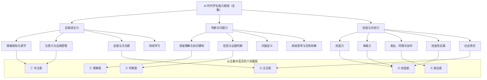

# AI 时代学生能力培养体系（讨论稿 0.6｜六块腹肌核心能力框架）

> **本版任务**：定义 AI 时代为什么尤其需要“六块腹肌”、它们各自是什么，以及如何在课内外长期培养。
>
> **核心立场**：AI 不构成一项与人的能力并列的独立能力。它是重新放大、也可能侵蚀人的基础能力的时代条件。

---

## 1. 核心命题

> **AI 可以外包任务，但不能外包成长。**

学生当然需要理解和使用 AI，但“会用 AI”并不是教育的最终目标。AI 不能替学生形成注意力、理解、判断、表达、方向、审美和责任；恰恰因为它能迅速代做许多任务，这些能力才更需要被有意识地保护和训练。

因此，本体系不设置一项与其他能力并列的“AI 协同力”。AI 的作用是一个贯穿全体系的检验问题：

> 当 AI 能替学生完成某一步时，学生自己仍需要保留什么能力，才能不失去主体性，并把 AI 用成真正的增益？

“六块腹肌”是对这个问题的回答。它们不是全部学生能力，而是从完整学生发展框架中筛选出的、在 AI 时代最不能被外包的六项基础能力。

---

## 2. 原有能力框架与六块腹肌的关系

本体系聚焦于**能力**，不试图罗列学生全部生活内容或身份内容。原有的三类能力仍是主框架；六块腹肌不是第四套体系，而是从这三类能力中跨维度挑出的、在 AI 时代尤其需要高亮的六项能力。

| 主框架 | 原有子能力（经本版补充） | 被高亮为六块腹肌的内容 |
|---|---|---|
| **自我成长力** | 情绪感知与调节；**注意力与自我管理**；自驱与方向感；持续学习。 | **① 专注肌**：情绪、注意力、冲动、数字使用与持续投入。 **⑤ 主见肌**：自驱、方向感和对选择的承担。 |
| **判断与问题力** | **深度理解与知识建构**；信息与证据判断；问题定义；系统思考与任务拆解。 | **② 理解肌**：读懂、组织并内化知识。 **③ 判断肌**：概念、论证、数据、因果与来源的判断。 |
| **创造与共创力** | 创造力；审美力；**表达、同理与协作**；**创造性实践**（观察、制作、测试与迭代）；社会责任。 | **④ 表达肌**：清楚表达、倾听、追问与理解他人。 **⑥ 创造肌**：将想法做成真实成果，并判断其质量与影响。 |

这里有三项对原框架的必要补充：

1. 在“自我成长力”中把**注意力**单列出来；它不能只隐含在自我管理里，因为 AI 时代最直接威胁的正是持续注意与独立投入。
2. 在“判断与问题力”中补入**深度理解与知识建构**；“信息与证据判断”解决的是可信性，“深度理解”解决的是学生是否真正读懂、记住并形成自己的知识结构，二者不能互相替代。
3. 在“创造与共创力”中补入**创造性实践**；这不是恢复一个泛化的“行动与实现”能力，而是把观察、制作、测试和迭代明确为创造力与审美力的现实训练场。
4. 将原有的“表达与协作”明确为**表达、同理与协作**；同理不是可有可无的品格装饰，而是理解真实对象、进行对话和创造公共价值的能力前提。

并非原框架中的每一项能力都要成为一块“腹肌”。六块腹肌的筛选标准是：

1. **不能外包**：由 AI 或他人代做后，学生自身不会自然获得；
2. **AI 时代风险更高**：AI 的便利会直接放大其缺失所造成的后果；
3. **高迁移性**：能跨学科、跨项目、跨人生阶段使用；
4. **可长期训练和观察**：能在课内外通过行动、作品、对话和反思逐步发展。

### 2.1 没有单列为“腹肌”的能力

以下能力没有被排除，而是没有单列为一块肌肉：

| 能力 | 在原框架中的位置 | 不单列为腹肌的原因 |
|---|---|---|
| **持续学习** | 自我成长力 | 它不是单一能力领域，而是六块肌肉持续发展的共同机制：发现不足、调整方法、接受反馈、再练一次。 |
| **问题定义** | 判断与问题力 | 它是理解、判断、表达和主见共同形成的高级过程；单列会与理解肌、判断肌和表达肌重叠。 |
| **系统思考与任务拆解** | 判断与问题力 | 它是处理复杂问题的方法能力，主要建立在理解肌和判断肌上，并在创造肌中得到应用。 |
| **同理与协作** | 创造与共创力 | 它已被明确补入主框架，并在表达肌、主见肌与创造肌中共同训练；单列会削弱“共创”本身的整合性。 |
| **社会责任** | 创造与共创力 | 它在主见肌中体现为对选择负责，在创造肌中体现为对真实对象和公共影响负责。 |

如果未来需要扩展为“八块”或更完整的能力地图，**身心健康与生活自理**是最值得优先考虑的新增能力群。但它目前不纳入六块腹肌：六块腹肌的任务是解释 AI 时代最容易被外包、也最需在学习中守住的核心能力，而不是穷尽学生生活的全部基础。

---

## 3. 六块腹肌：AI 时代最不能外包的基础能力

### 3.1 总览

| 六块腹肌 | 一句话定义 | AI 为什么使它更重要 |
|---|---|---|
| **专注肌** | 管理注意力、情绪、冲动与数字使用，保持持续投入的能力。 | AI 和信息流同时降低启动成本、提高即时反馈，学生更容易把专注、忍耐和独立完成外包。 |
| **理解肌** | 读懂、倾听、记忆、复述并将信息组织成自己的知识结构的能力。 | AI 能给摘要和结论，却不能保证学生真正理解原意、条件和知识之间的关系。 |
| **判断肌** | 判断概念、论证、数据、因果和来源是否成立的能力。 | AI 的错误常常流畅而自信；没有证据判断，学生无法分辨答案是否可靠。 |
| **表达肌** | 将想法、需求、理由和限制说清、写清，并理解他人的能力。 | AI 的输出质量取决于学生能否给出清楚目标、背景、限制和评价标准。 |
| **主见肌** | 形成自己的价值、兴趣、方向与选择，并对选择及其影响负责的能力。 | AI 能给建议和推荐，却不能替学生决定什么值得做、愿意为谁负责。 |
| **创造肌** | 将观察、知识和价值转化为作品、方案或服务，并判断其是否有质量的能力。 | AI 能快速生成选项，但不能替学生决定何者有意义、适合谁、应如何打磨并承担影响。 |

### 3.2 第一肌：专注肌

**定义**：学生能觉察自己的情绪、压力和注意力状态，管理冲动、屏幕与工具使用，并为了重要目标持续投入。

| 基础能力 | AI 时代的意义 | 课内培养 | 课外培养 |
|---|---|---|---|
| 情绪觉察与调节 | 不因焦虑、无聊或挫败立即用 AI、短视频或答案逃离任务。 | 班会与导师制中的情绪识别、学习复盘；在项目中讨论挫败和求助。 | 睡眠、运动、家庭对话、稳定的屏幕与 AI 使用边界。 |
| 注意力与工作记忆 | 能持续阅读、倾听和处理复杂材料，不被工具频繁打断。 | 无 AI 的深度阅读、笔记、复述、限时专注任务。 | 运动、乐器、手作、长时阅读和低干扰生活节律。 |
| 延迟满足与数字自律 | 不以“最快得到答案”替代必要练习。 | 先独立完成关键步骤、后使用 AI 的双通道任务。 | 家庭设备规则、共同制定暂停和恢复使用机制。 |

### 3.3 第二肌：理解肌

**定义**：学生能够穿过碎片信息，理解文本、对话、概念和经验，并将其组织为可调用的知识结构。

| 基础能力 | AI 时代的意义 | 课内培养 | 课外培养 |
|---|---|---|---|
| 长文本阅读与倾听 | 能回到原文、原始材料和真实他人，而不只接受摘要。 | 语文、英语、历史、科学中的精读、标注、复述和多文本比较。 | 阅读整本书、观看后讨论、访谈长辈与真实观察。 |
| 知识组织与复述 | 能将信息变为自己的理解，而不是复制 AI 的表达。 | 概念图、学习日志、无辅助讲解、跨学科连接。 | 讲给家人或同伴听、建立个人笔记与主题档案。 |
| 语境与限定条件理解 | 能识别 AI 摘要遗漏的前提、例外和立场。 | 原文与 AI 摘要对照、史料和实验材料比较。 | 关注同一事件的不同叙事，练习追溯原始来源。 |

### 3.4 第三肌：判断肌

**定义**：学生能检查一个说法的概念、理由、证据、数据与推理是否成立，并在不确定中作出有边界的判断。

| 基础能力 | AI 时代的意义 | 课内培养 | 课外培养 |
|---|---|---|---|
| 论证与反例 | 能发现 AI 回答中的隐含前提、偷换概念和结论跳跃。 | 逻辑、辩论、历史分析、论证写作；要求学生为 AI 答案找反例。 | 针对热点观点进行“主张—证据—反证”讨论。 |
| 数据、概率与因果 | 能识别图表误导、样本偏差、相关不等于因果和过度预测。 | 数学、统计、科学实验、社会科学研究。 | 解读新闻图表、家庭调查、小型公共数据项目。 |
| 来源核验与媒介判断 | 不把 AI 输出、短视频或搜索摘要当作来源。 | 研究方法、图书馆检索、新闻与媒介素养、引用规范。 | 事实核查练习、比较多家报道、识别合成媒体。 |

### 3.5 第四肌：表达肌

**定义**：学生能将自己的观点、需求、证据和限制组织成他人可理解的表达，也能认真倾听、追问和转述他人的意思。

| 基础能力 | AI 时代的意义 | 课内培养 | 课外培养 |
|---|---|---|---|
| 书面与口头表达 | 能把模糊愿望转化为清楚问题，而非只输入一句泛泛指令。 | 写作、修辞、演讲、辩论、从提纲到成文的多轮修改。 | 播客、日记、讲解视频、公共写作。 |
| 目的、受众与限制意识 | 能向人和 AI 说明“为谁说、要达到什么、不能做什么”。 | 改写练习、不同受众表达、需求说明书和项目简报。 | 组织活动、写信、采访、与不同年龄者沟通。 |
| 倾听、提问与对话 | 不把 AI 当成唯一对话对象，保留与真实人共同理解问题的能力。 | 采访、苏格拉底式讨论、同伴反馈、协作项目。 | 家庭访谈、社区观察、志愿服务与跨代对话。 |

### 3.6 第五肌：主见肌

**定义**：学生逐步形成“我是谁、我在乎什么、我愿意为谁解决什么问题”的认识，并对自己的选择、过程和影响负责。

| 基础能力 | AI 时代的意义 | 课内培养 | 课外培养 |
|---|---|---|---|
| 自我同一性与方向感 | 不被模型推荐、热点或成人脚本替代人生方向。 | 导师制、反思写作、生涯探索、兴趣与问题地图。 | 长期兴趣、真实劳动、与不同职业和生活方式的人对话。 |
| 价值判断与伦理思考 | 能判断 AI 是否适合介入，以及“能做”是否等于“该做”。 | 哲学、伦理讨论、AI 伦理、案例辩论。 | 家庭规则共建、公共议题讨论、社区参与。 |
| 过程责任与公共责任 | 对数据、隐私、版权、署名和真实对象的影响负责。 | 研究诚信、AI 使用披露、项目角色与责任复盘。 | 家庭承诺、志愿服务、照护与公共行动。 |

### 3.7 第六肌：创造肌

**定义**：学生从真实观察和价值判断出发，提出并实现方案，同时能评价作品、产品或表达在形式、体验、意义和适配性上的质量。

| 基础能力 | AI 时代的意义 | 课内培养 | 课外培养 |
|---|---|---|---|
| 问题发现与方案生成 | 不从“我能用什么工具”出发，而从“谁遇到了什么问题”出发。 | 人本设计、项目制学习、用户观察、研究问题设计。 | 校园和社区观察、访谈、志愿服务、个人兴趣项目。 |
| 制作、测试与迭代 | 能把 AI 的生成结果变成经过检验的真实作品或服务。 | 原型、实验、编程、设计、作品评审、用户测试。 | 手作、艺术、创客活动、社团组织和小型服务实践。 |
| 审美与质量判断 | 能判断“看起来不错”是否真正合适、可信、有体验价值。 | 艺术、设计、文学、影像分析、作品批评。 | 博物馆、演出、摄影、游戏和日常产品的观察与讨论。 |

---

## 4. AI 在六块腹肌中的正确位置

AI 不是六块腹肌之外的第七项能力，而是每一块肌肉都要面对的“双重效应”。

| 六块腹肌 | AI 可以增强什么 | AI 可能侵蚀什么 | 教育上的基本原则 |
|---|---|---|---|
| 专注肌 | 降低机械负担、提供即时反馈与辅助计划。 | 深度注意、延迟满足、独立完成与情绪调节。 | 关键认知任务先由学生完成；家庭和学校共同建立使用边界。 |
| 理解肌 | 提供解释、比较、练习和多种表述。 | 阅读原文、记忆、复述和知识结构建构。 | 用 AI 比较与追问，不用 AI 代替理解。 |
| 判断肌 | 提供反例、不同立场、数据处理与论证草案。 | 独立判断、证据敏感度和不确定性意识。 | 要求核验来源、指出局限并保留人的最终判断。 |
| 表达肌 | 提供表达反馈、受众模拟和结构建议。 | 个人声音、真实倾听与清楚表达需求的能力。 | AI 可协助修改，不能代替学生形成观点。 |
| 主见肌 | 支持探索选择、了解行业和比较路径。 | 人生方向、价值判断、署名与伦理责任。 | AI 可以提供信息，不能替学生作人生决定或承担后果。 |
| 创造肌 | 加速构思、可视化、原型和迭代。 | 原创取舍、质量判断、与真实对象的关系。 | 从真实问题出发；允许结论是“这里不该用 AI”。 |

### 4.1 所有课程通用的 AI 使用结构

1. **先做人类基线**：学生先独立完成关键步骤，如阅读、观察、初步判断、研究问题或方案；
2. **再进行 AI 协作**：使用 AI 获取解释、反例、备选方案、表达反馈、数据处理或原型支持；
3. **最后比较与负责**：说明 AI 改变了什么、什么不可靠、自己保留或否决了什么，以及证据为何。

---

## 5. 理论来源

本体系不是照搬单一理论，而是将成熟的学生发展、社会情感学习、认知、创造力和教育实践框架转化为 AI 时代的培养语言。

| 六块腹肌 | 主要支持来源 |
|---|---|
| 专注肌；主见肌 | [自我决定理论（SDT）](https://selfdeterminationtheory.org/about-the-theory/)、[CASEL 社会情感学习框架](https://casel.org/fundamentals-of-sel/what-is-the-casel-framework/)、[OECD Learning Compass 2030](https://www.oecd.org/en/data/tools/oecd-learning-compass-2030.html) |
| 理解肌 | 阅读理解、认知心理学与知识建构研究；[OECD Learning Compass 2030](https://www.oecd.org/en/data/tools/oecd-learning-compass-2030.html) 对基础素养与学生主体性的强调。 |
| 判断肌 | [问题式学习研究](https://doi.org/10.1023/B:EDPR.0000034022.16470.f3)、探究式学习、统计与媒介素养教育。 |
| 表达肌 | 修辞与写作教育、对话式教学、CASEL 的关系技能与社会觉察。 |
| 创造肌 | [OECD PISA 2022 创造性思维框架](https://www.oecd.org/en/publications/pisa-2022-results-volume-iii_765ee8c2-en/full-report/component-15.html)、[UNESCO 文化与艺术教育框架](https://www.unesco.org/sites/default/files/medias/fichiers/2024/02/WCCAE_UNESCO%20Framework_EN_0.pdf)、[Design Council Double Diamond](https://www.designcouncil.org.uk/resources/framework-for-innovation/)。 |

AI 作为时代情境的教育参考，可使用 [UNESCO《学生 AI 能力框架》](https://www.unesco.org/en/articles/ai-competency-framework-students?hub=195885)：它强调以人为本、伦理、技术应用和系统设计，而非单纯工具操作。

---

## 6. 对外表述

> **AI 时代，先练六块腹肌：把人长出来，再把工具用起来。**

可搭配使用：

- AI 可以外包任务，但不能外包成长。
- 工具会换，人的底子不能空。
- 不和 AI 比手速，练成能理解、能判断、能创造、能负责的人。
- 先建立人类基线，再学习与 AI 协作。
