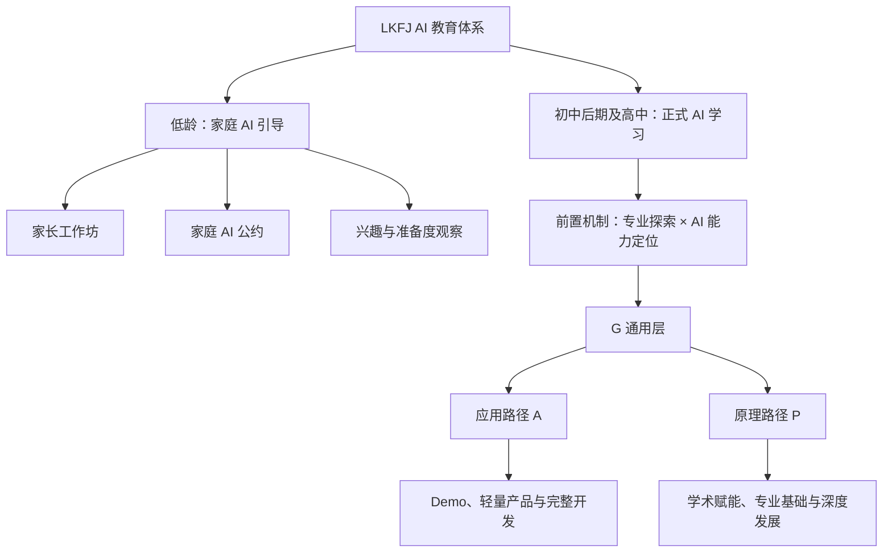

# AI 力基础教育框架（讨论稿 0.5｜LKFJ 分层课程体系版）

> **当前口径**：本版以 2026 年 7 月 24 日确认的课程结构为准。若与 0.2—0.4 或其他旧材料冲突，均以本版为准。
>
> **行动代号**：LKFJ，即“六块腹肌 / 六块腹基”。它指向 AI 时代需要长期练就的稳定核心，而不是六门机械的必修课。

## 1. 一句话定位

LKFJ 面向未来 AI 世界，帮助家庭和学生在合适的阶段学合适的内容：低龄先建立人、家庭与 AI 的健康关系；初中后期起，再将兴趣、基础和目标转化为可验证的 AI 学习路径。

我们不卖“快速学会一个工具”，也不把“一句话做出 App”当作 AI 能力。真正的 AI 力，是在具体场景中理解问题、做出判断、与 AI 协作、验证结果，并对过程和结果负责的能力。

### AI 是能力放大器，不是人生方向生成器

AI 可以把已有的创造力、结构化思维、研究能力、表达能力和行动能力，更快地转化为实现、呈现与影响；它也能在适当的任务中帮助学习者补齐必要的能力缺口。但 AI 不能替人决定什么值得做、自己关心什么问题，或代替人形成真实的判断与责任。

因此，LKFJ 的教育顺序不是“先学工具，再找用途”，而是：先看清学习者的目标、问题、基础与优势；再判断哪些基础能力需要继续培养，哪些已有优势最值得被 AI 放大；最后才决定使用什么 AI、学习什么内容、学到什么深度。补短板和放大长板并不矛盾，二者都要服务于同一个明确的 purpose。

这也意味着，不是所有学生都应先学 Python、GitHub 或模型训练。擅长历史、戏剧、写作或其他领域的学生，首先需要学会如何让 AI 服务于该领域的问题与创作；只有当目标需要承担开发、协作、上线或模型研究的责任时，才进入相应的技术学习。

### AI 将成为基础教育的一部分

LKFJ 的一个基本判断是：AI 大概率会成为基础教育的一部分。这不必然意味着每个孩子都要尽早学习模型训练，也不等于把 AI 当成又一门孤立的科创课；它更可能逐步进入学习、表达、研究、组织工作和社会生活。

因此，LKFJ 不只是做 AI 科创。我们是在尝试把 AI 放回基础教育的语境：在合适的年龄建立边界和判断，在正式学习阶段把它与学科学习、问题意识、数据能力、项目实践和个人发展连接起来。

## 2. 总体架构：两个阶段，一套能力地图

| 阶段 | 主要服务对象 | 核心问题 | 主要产品形态 | 不做什么 |
|---|---|---|---|---|
| **低龄阶段：家庭 AI 引导** | 初中后期之前的家长与家庭 | 孩子如何在不被 AI 替代成长的前提下接触和使用 AI？ | 家长工作坊、家庭诊断、家庭 AI 公约、主题讲座 | 不把孩子送进长期工具培训；不以“AI 小创客”包装替代基础能力 |
| **正式学习阶段：AI 学习体系** | 初中后期及高中学生，家长共同参与决策 | 这个学生现在适合从哪里开始；AI 在其发展方向中要用到什么程度；下一步学什么？ | 前置定位、分层课程、短项目、长期项目、导师服务 | 不用年龄或热点替代能力判断；不把一次项目包装成长期能力 |

年龄是重要参考，而不是机械分界。初中后期之前，教育重点始终是阅读、表达、专注、现实经验、学科基础与自我管理；具备更强抽象能力、稳定兴趣和自主学习准备的学生，可在家长共同判断下提前进入有限的探索。

## 3. 低龄阶段：先帮助家长，而不是急着教孩子“学 AI”

### 3.1 核心判断

在初中后期之前，孩子最需要积累的仍是基础学力与人的能力：语言和阅读、数感与逻辑、注意力、现实体验、社交、审美、好奇心、独立表达与责任感。AI 可以成为有限场景中的辅助工具，但不应替代这些能力的形成。

因此，这一阶段的主要客户和学习者是家长。LKFJ 不主张“越早上 AI 课越好”，而是帮助家庭做出不过度、不过早、不失控的判断。

### 3.2 家长工作坊的四个主题

| 工作坊 | 要解决的问题 | 家长带走的交付 |
|---|---|---|
| **认识 AI：能力、局限与风险** | AI 会什么、不会什么；为什么“像懂了”不等于真的可靠 | 家庭可用的 AI 基本认知与核验清单 |
| **家庭使用边界** | 屏幕时间、账号、隐私、作业、创作与情感陪伴如何设边界 | 可执行的《家庭 AI 公约》 |
| **引导孩子正确相处** | 如何把 AI 用在提问、复盘、解释和亲子创作，而非代答与依赖 | 适龄场景卡与亲子对话方法 |
| **为正式学习做准备** | 现在该补什么基础；何时可以进入更系统的 AI 学习 | 孩子的兴趣与准备度观察表、下一阶段建议 |

### 3.3 家庭 AI 公约：最低可执行版本

家庭 AI 公约不追求复杂，而应写清以下六件事：

1. 哪些设备、账号和信息可以使用，哪些个人信息绝不输入；
2. 每种使用场景的时间与陪伴规则；
3. 作业中哪些步骤必须由孩子先独立完成；
4. AI 可以帮助解释、提问和反馈，但不能直接代写、代答或伪造过程；
5. 重要事实、图片、引用和结论如何核验；
6. 当孩子感到焦虑、孤独或困惑时，优先找真实的人，而不是把 AI 当情感替代。

### 3.4 低龄阶段的边界

- 不以“孩子会用多少 AI 工具”评价成长；
- 不用生成作品取代孩子的阅读、手写、表达、动手和现实协作；
- 不用成人脚本包装儿童项目或公开表达；
- 不把聊天机器人当陪伴者、权威答案或隐私容器；
- 不因家长焦虑而提前进入高强度编程、模型训练或作品集项目。

## 4. 正式学习阶段：从“现在适合学什么”开始

### 4.1 从 purpose 出发

正式学习不从“学哪个工具”开始，而是先回答：

1. 这个学习者关心什么问题，可能走向什么专业、领域或角色？
2. AI 在其中要承担什么作用：辅助学习、辅助研究、完成 Demo、做产品，还是理解/开发模型？
3. 他/她目前具备哪些能力，哪些暂时还不需要？
4. 因此，现在最值得学习的下一步是什么？

目标不是让所有人走同一条 AI 路，而是帮助每个人只学习自己真正用得上的内容，并在真实任务中形成可验证的能力。下文的前置机制、G 通用层和 A/P 路径，共同构成正式学习阶段的课程架构。

### 4.2 前置机制：专业探索 × AI 能力定位

专业探索和 AI 能力定位同时进行，但在课程体系中，它们首先是**前置机制**，不是一门普通课程。

| 组成 | 要判断的问题 | 主要交付 |
|---|---|---|
| 专业探索 | 我长期关心什么问题？适合哪些学科、领域和角色？ | 兴趣与问题地图、专业/方向假设 |
| AI 使用方向判断 | 在这个方向中，AI 应该用到什么程度？ | 学习、研究、创作、产品、数据、模型等用途判断 |
| AI 能力定位 | 当前的阅读、表达、数据、编程、项目与 AI 协作基础在哪里？哪些是必须补足的基础，哪些是可被 AI 放大的已有优势？ | 能力基线、优势/缺口判断、G/A/P 起点建议与暂不建议投入的方向 |
| 路径建议 | 接下来 6—12 个月应如何组合课程、项目与支持？哪些内容现在不必学？ | 个性化学习路径、阶段目标与“暂不投入”清单 |

定位不是一次性的职业预测或标准化测评。它是正式学习的入口判断：先确定 purpose，再决定选择哪些 G、A 或 P 内容，以及每项内容需要学到的责任深度；在完成阶段课程或项目后，可据新证据更新路径。

#### 4.2.1 定位后的课程决策规则

每一项学习建议都应能回答四个问题：

1. 它服务于学习者正在解决的哪个问题或长期目标？
2. 它是在补一项不可绕过的基础，还是在放大一项已有优势？
3. 现在需要学到什么深度，对应要承担什么责任？
4. 如果暂时不学，会不会妨碍当前目标；若不会，就不把它当成必修？

例如，只需要验证想法、完成展示的学生，可先进入 A1，而不必为此学习 GitHub、数据库或完整工程开发；当产品要上线、协作或服务真实用户时，再进入 A2 的相应单元。Python 也不是“学习 AI”的统一入口：它适合需要数据处理、模型实验或软件开发的人，而非所有对 AI 感兴趣的学生。

#### 4.2.2 不同阶段的使用方式

| 阶段 | 前置机制的重点 |
|---|---|
| 初中后期之前 | 观察兴趣、基础能力、学习习惯与 AI 准备度；主要供家长判断边界与下一步 |
| 初中后期及高中 | 将专业/兴趣方向与 AI 使用方向同步判断，确定课程起点与路径 |
| 目标已明确的高年级学生 | 反推目标所需能力，判断 LKFJ 可交付部分、需长期补足部分及外部资源路径 |

## 5. G 通用层：所有路径可调用的公共基础

G 层不是一组所有人必须按次序刷完的课。它是每个学习者在进入应用 A 或原理 P 前后，按自身目标选择的共同能力范围。其中 G0 是所有课程和项目都必须遵守的共同底线。

| 层级 | 名称 | 要解决的问题 | 核心内容 | 适用说明 |
|---|---|---|---|---|
| **G0** | AI 伦理与学术诚信 | 使用 AI 时，哪些事不能越界，哪些过程必须诚实、可追溯？ | 隐私与数据保护、版权与署名、偏见与伤害、事实核验、AI 使用披露、作业与研究诚信、伪造风险、对他人的责任 | 所有学习者和所有课程的共同底线；低龄主要面向家长建立规则 |
| **G1** | AI 通识与工具地图 | AI 是什么、能做什么、不能做什么？ | 基础原理、模型能力与局限、工具类型与选择、提示与上下文、事实核验与使用边界 | 所有正式学习者的共同起点；低龄以家长工作坊方式进入 |
| **G2** | AI 赋能学习 | 如何让 AI 帮助学习，而不替我学习？ | 预习与复盘、错题分析、写作反馈、检索与资料判断、语言学习、学习诚信、反思记录 | 低龄阶段由家长引导、有限使用；高年级可系统学习 |
| **G3** | AI 原生组织工作 | 如何把资料、任务、知识和项目组织成可推进的工作流？ | 文件与资料管理、个人知识库、任务拆解、项目记录、轻量自动化、版本意识、基础协作 | 主要面向初中后期及高中，为项目和产品学习打底 |
| **G4** | 个人叙事与品牌建设 | 如何把方向、积累和成果表达成可信的长期记录？ | 自我理解、方向表达、数字身份、作品集、过程档案、公开表达、内容策略、隐私边界、AI 使用披露 | 不等同于做账号；低龄仅涉及表达与数字身份边界 |
| **G5** | 问题意识与项目制学习 | 如何从真实观察出发，把一个问题推进成可验证的项目？ | 问题发现、调研、问题定义、假设、需求/研究设计、任务拆解、过程记录、反馈、迭代与复盘 | A、P 路径的共同项目方法；适合在创客营和后续项目中使用 |

### 5.1 G 层的使用原则

- G0 是所有 G/A/P 路径的共同底线，不作为可跳过的附加内容；
- G1 是共同起点，但不应变成工具清单课；
- G2 与 G3 分开：前者关注真实理解是否发生，后者关注事情是否被清楚地组织和推进；
- G4 用于形成可信的个人叙事与作品档案，不以流量、账号或儿童包装为目标；
- G5 用于把兴趣变成问题、把问题变成项目，是连接专业探索与 A/P 路径的实践方法；
- 课程组合由前置机制决定，而不是要求每个学生平均发展全部 G 能力。
- 不以“掌握的工具数量”或“学过的技术名词”衡量 AI 力；学习深度取决于目标与责任，而不是热点或家长焦虑。

## 6. 应用路径 A：把 AI 用成可以交付的能力

应用路径培养的是：能够用 AI 在真实场景中完成工作、解决问题、交付成果的人。

| 层级 | 能力定义 | 典型成果 | 责任边界 | 建议的前置/配套能力 |
|---|---|---|---|---|
| **A1** | 综合应用 AI 工具完成 Demo | 能表达思路、展示逻辑与核心体验的作品或原型 | 对问题、过程和演示负责；不承诺稳定给真实用户使用 | G0 + G1 + G5 为核心；按项目需要加入 G2/G3/G4 |
| **A2** | 完成供自己或少量用户实际使用的轻量产品 | 轻量应用、工具或工作流，并获得真实反馈 | 要考虑用户、数据、权限、测试、维护与基本稳定性 | A1 + G3；产品叙事可加入 G4 |
| **A3** | 面向完整开发的工程路径 | 可持续开发与维护的产品或系统 | 要对系统正确性、安全、性能、版本、部署与长期维护负责 | A2 后进入；需补足计算机与软件工程基础 |

A2、A3 都是能力阶段，不是单门“大课”。后续会按目的、基础和交付责任拆成更细的课程单元与项目支持。

### 6.1 现有产品的位置：AI 创客营

现有 AI 创客营的对外定位为：**G1 + G5 + A1 的组合产品**，并以 G0 为共同底线。

学生完成创客营后，应具备从一个想法或真实问题出发，理解基本 AI 工具和边界，并综合应用 AI 工具完成 Demo 的能力。它不承诺学生已具备独立上线产品或全量开发的工程能力。

### 6.2 A2 与 A3 的细分课程方向

| 层级 | 后续可拆分的课程/项目单元 |
|---|---|
| A2 | 产品场景与需求、AI 编程、基础数据库与权限、用户测试、反馈与迭代、基础维护 |
| A3 | 计算机与软件工程基础、全量开发、系统设计、测试、部署、安全、性能与长期维护 |

A3 可先作为能力框架、方向判断和资源路径；是否由 LKFJ 完整交付，取决于后续师资、课程资源与产品规划。

### 6.3 现有一对一产品的位置

现有一对一产品位于创客营之后的**个性化进阶与路径支持**位置。它不替代 G0 或前置机制，而是在完成定位后，围绕学生的具体 purpose 补足 A2、A3，或衔接 P 路径所需的课程、项目与导师支持。对于已具备相应基础、目标明确的学生，一对一不必机械地等待完成创客营，可在前置机制判断后直接进入适合的 A/P 细分单元；但必须明确其当前责任边界和需要补齐的前置能力。

## 7. 原理路径 P：按用途理解、使用与发展 AI

原理路径培养的是：能够依据自己的 purpose，理解、使用、评估，乃至深入开发 AI 模型与系统的人。

| 层级 | 能力定义 | 适合对象 | 学习重点 | 典型成果 |
|---|---|---|---|---|
| **P1** | AI 赋能学术与专业问题 | 希望用数据、模型或实验方法推进本学科问题的人 | 数据与材料处理、统计和证据、基础模型实验、研究设计、结论边界 | 数据分析、语料/图像材料处理、基础实验与研究过程记录 |
| **P2** | AI/算法专业基础 | 准备进入 AI、CS、数据等相关专业的人 | 数学统计、Python、机器学习、深度学习基础、实验设计、标准模型与评测 | 可复现实验、机器学习项目、模型评测、代码与实验记录 |
| **P3** | 模型、算法与系统深度发展 | 目标是算法工程、模型研发或高阶研究的人 | 算法/模型改进、训练与推理优化、系统工程、论文复现与研究性工作 | 算法或模型改进、系统项目、研究记录与可审查成果 |

### 7.1 P 路径的目的差异

“模型训练”不是统一的课程终点，应按 purpose 决定深度：

| 学习者目的 | 建议到达的层级 | 应学到的程度 |
|---|---|---|
| 用 AI 支持历史、社会科学、科学或其他学科研究 | P1 | 能处理材料、理解数据与实验边界，并选择适合自己问题的基础方法 |
| 准备读 AI、CS、数据等专业 | P2 | 能真正理解、复现、选择、修改和评估已有主流方法 |
| 目标是高水平算法工程、模型研发或研究 | P3 | 能针对新问题改进方法，或让模型系统在复杂条件下稳定工作 |

P2 与 P3 的区别不只在“更难”。P2 的重点是把已有的标准方法真正学会并用对；P3 的重点是改方法、做系统，或将研究推向新的问题和性能边界。

P2 可以逐步设计为完整课程体系。P3 在现阶段首先是高阶发展框架、能力门槛、项目标准与外部资源路径；未来再根据师资与资源决定是否拆为课程或导师制。

### 7.2 P1、P2、P3 的细分课程方向

P1、P2、P3 同样是能力阶段，而不是各自一门单独的课程。后续会按学习者的学科、目标和已有基础，拆成更细的课程单元。

| 层级 | 后续可拆分的课程/项目单元 |
|---|---|
| P1 | 学科问题与研究设计、数据与统计基础、文本/图像/其他材料处理、基础模型实验、研究证据与结论边界 |
| P2 | 数学与统计、Python 与计算基础、机器学习、深度学习、实验设计与复现、模型评测与工程基础 |
| P3 | 模型与算法改进、训练与推理优化、AI 系统与工程、论文复现与研究设计、前沿专题与导师制项目 |

## 8. 两阶段服务与产品承接

| 阶段 | 主要服务对象 | 核心任务 | 主要产品形态 |
|---|---|---|---|
| **初中后期之前** | 家长与家庭 | 保护基础能力，观察兴趣与准备度，建立 AI 使用边界 | 家长工作坊、家庭 AI 公约、亲子任务、兴趣与准备度观察；有限进入 G1/G2 |
| **初中后期及高中** | 学生与家长共同决策 | 完成前置机制，按 purpose 组合 G/A/P 路径，积累真实证据 | 定位咨询、通用层课程、AI 创客营、AI 大学预备营、专题课程、项目制学习、一对一与长期规划 |

低龄阶段不以学生 AI 技能课为核心产品，不把生成作品或“会几个工具”当作成长证明。阅读、表达、数感、现实体验、自我管理和人际关系仍是更重要的底盘。

## 9. 典型路径示例

| 目的 | 推荐组合 |
|---|---|
| 将自己的想法做成可展示的项目 | 前置机制 → G1 + G5 → A1（AI 创客营） |
| 做一个少数人真实使用的工具 | 前置机制 → G1 + G3 + G5 → A1 → A2 |
| 走程序员或工程开发方向 | 前置机制 → G1 + G3 + G5 → A1/A2 → A3 |
| 用 AI 推进历史、社会科学或其他学科研究 | 前置机制 → G1 + G2 + G5 → P1 |
| 准备申请 AI、CS、数据相关专业 | 前置机制 → G1 + G2 + G3 + G5 → P2 |
| 目标是算法工程、模型研发或高阶研究 | 前置机制 → G1 + G2 + G3 + G5 → P2 → P3 |
| 建立长期项目叙事、作品集或公开表达 | 在对应路径中同步加入 G4 |
| 擅长历史、戏剧、写作等领域，希望借助 AI 做研究或创作 | 前置机制 → 围绕领域问题补 G1 + G5 → 按需要进入 P1 或 A1；不以 Python 为默认起点 |

## 10. 评价与证据标准

任何课程或项目都应留下可回溯的证据，而不只留下生成结果：

- 问题从何而来，学习者自己的判断是什么；
- AI 在哪些环节参与，人保留哪些关键决策；
- 使用什么资料、数据或工具，如何核验；
- 有哪些版本、失败、反馈和修改；
- 最终成果解决什么问题，仍有哪些局限；
- 学习者是否能用自己的语言解释过程与结果。

需要明确区分：完成 Demo，不等于可以上线产品；跑出模型结果，不等于完成可靠研究；生成一份漂亮内容，不等于形成表达、审美或判断能力。

## 11. 内容表达与品牌叙事

对外内容仍沿用三条线，但每一条都服务于这套双阶段产品体系：

| 内容线 | 面向的核心问题 |
|---|---|
| **AI 教育观** | 家长如何理解不同阶段的培养重点、家庭边界与长期能力？ |
| **AI 实战派** | 学生在学习、创作、产品、数据和研究中，怎样真正把 AI 用起来并验证结果？ |
| **AI 现场观察** | 新模型、政策、学校、专业与行业变化，对不同年龄和目标的学生意味着什么？ |

每条内容都应尽量说明：适合谁、解决什么问题、需要什么前提、如何验证、下一步可进入哪一个工作坊、通用模块或路径。内容的作用不是堆砌热点，而是帮助家庭和学生降低决策成本。

## 12. LKFJ 的课程语言

“六块腹肌 / 六块腹基”是 LKFJ 的行动代号。它提醒我们：工具会变，底子不能空。读得懂、问得准、说得清、算得清、做得出、能负责这六项稳定核心，贯穿前置机制、G 通用层和 A/P 路径，但不以六门固定课程的方式出现。

在对外表达中，应把重点放在：让学习者找到自己的方向，练出能支撑这个方向的能力，而不是追逐每一个新模型或新工具。

## 13. 本版明确取舍

1. 专业探索 × AI 能力定位是进入正式体系的**前置机制**；
2. G 层扩展为 G0—G5，其中 G0 是 AI 伦理与学术诚信的共同底线，G5 负责问题意识与项目制学习；
3. AI 创客营定位为 **G1 + G5 + A1**；
4. 应用路径使用 A1—A3，原理路径使用 P1—P3；旧 M 编号停止对外使用；
5. P 路径按学习者的 purpose 分层，不将“模型训练”包装为统一终点；
6. A3、P3 目前首先是能力框架与方向路径，不承诺由 LKFJ 完整交付；
7. 行动代号统一为 **LKFJ**，不使用 ARK 作为本体系代号。
8. A2、A3、P1、P2、P3 都将按 purpose 拆分为更细的课程单元；现有创客营承担 G1 + G5 + A1，一对一承担个性化进阶与路径支持。
9. G/A/P 的细分单元、先修要求与难度见《LKFJ课程模块地图（讨论稿0.1）》。
10. AI 大学预备营面向即将进入大学的学生，聚焦 AI 学术诚信、研究与写作中的负责任使用，以及大学场景下的工具选择与核验。
11. AI 是能力放大器，不是统一技术学习的理由；课程选择必须同时回应学习者的目标、必要基础与可放大的已有优势。
