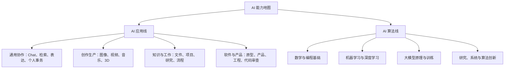
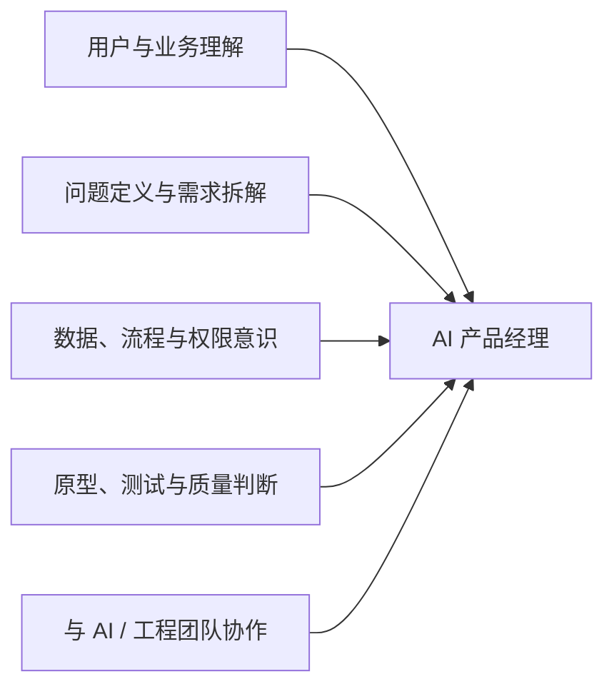

# AI 力基础教育框架（讨论稿 0.2）

## 目录

1. [核心定位：AI 力是场景化解决真实问题的能力](#1-核心定位ai-力是场景化解决真实问题的能力)
2. [设计原则与边界](#2-设计原则与边界)
3. [总体架构：阶段、底座、双线、场景与责任](#3-总体架构阶段底座双线场景与责任)
4. [年龄与人生阶段：何时学什么](#4-年龄与人生阶段何时学什么)
5. [共同能力底座：AI 不能替代的人类能力](#5-共同能力底座ai-不能替代的人类能力)
6. [AI 应用线：从会用到专业应用](#6-ai-应用线从会用到专业应用)
7. [AI 算法线：从计算思维到研究创新](#7-ai-算法线从计算思维到研究创新)
8. [场景地图：在什么问题中学习 AI](#8-场景地图在什么问题中学习-ai)
9. [责任门槛：不同目标要学到什么程度](#9-责任门槛不同目标要学到什么程度)
10. [学习、作品与研究的证据标准](#10-学习作品与研究的证据标准)
11. [从专业探索到职业方向](#11-从专业探索到职业方向)

---

## 1. 核心定位：AI 力是场景化解决真实问题的能力

我们不把 AI 教育定义为“10 小时学会一个工具”，也不把它等同于“会写提示词”或“能生成代码”。

> AI 力，是一个人在具体场景中，能够理解问题、表达需求、敏捷学习并调用合适的 AI、验证过程与结果，并对结果承担相应责任的能力。

因此，AI 教育的起点不是“今天学哪个模型”，而是：

- 我面对的是什么真实问题？
- AI 在其中能帮助什么，不能替代什么？
- 我需要对结果负责到什么程度？
- 为此，我要掌握哪些基本能力、方法和工具？

AI 力包括两条可互通但不应混同的主线：

| 主线 | 核心目标 | 典型场景 |
|---|---|---|
| AI 应用线 | 用 AI 放大学习、创作、协作与生产力 | 学习辅助、内容创作、项目管理、产品原型、科研 |
| AI 算法线 | 理解、构建与改进 AI 系统 | 编程、数据、机器学习、模型训练、工程部署、研究 |

低阶段，两条线共享人本能力与计算思维；高阶段，学生可根据兴趣、学科基础和职业目标分流。不是每个人都要成为算法工程师，也不是每个会使用 AI 的人都需要掌握全量开发。

## 2. 设计原则与边界

### 2.1 先成人，后工具

语言、阅读、专注、现实社交、独立思考和责任感，是 AI 时代更重要而不是更不重要的能力。尤其对低龄儿童，AI 不应替代本应由其完成的表达、探索、阅读与人与人之间的互动。

### 2.2 先场景，后技巧

不教脱离任务的“万能提示词”，而要回答：在学习、创作、研究、产品或协作中，何时使用 AI、如何给足上下文、如何迭代、如何核验、何时应停止使用。

### 2.3 先问题，后项目

项目的价值不在于展示“我用了 AI”，而在于学生发现了什么问题、提出了什么判断、做出了什么可验证的尝试，以及从失败中学到了什么。

### 2.4 先证据，后包装

成果必须能回溯到过程：问题来源、资料与数据、版本记录、测试、用户反馈、修改和反思。生成一份好看的报告、代码或 PPT 不是能力本身。

### 2.5 责任随能力升级

能生成代码不等于会编程；能做出页面不等于能交付产品；能跑出结果不等于完成研究。学习路径必须明确每一级可以承担什么、尚不能承担什么。

## 3. 总体架构：阶段、底座、双线、场景与责任

本框架采用五层结构：

1. **年龄与人生阶段**：解决“何时学”。
2. **共同能力底座**：解决“先长成什么样的人”。
3. **应用线与算法线**：解决“沿哪条主线发展”。
4. **场景模块**：解决“在什么真实任务中练习”。
5. **责任门槛与证据标准**：解决“学到什么程度算真正会”。

这五层共同构成一张“场景—能力—责任”地图：同一个学生可以在 AI 创作上达到专业应用，在编程上只停留于基础协作；也可以走深算法路径，却仍须具备真实场景、用户与伦理意识。

## 4. 年龄与人生阶段：何时学什么

| 阶段 | 主要对象 | 教育重点 | 不宜做什么 | 代表性交付 |
|---|---|---|---|---|
| 学前—小学中低年级 | 家长为主 | 现实体验、语言、阅读、规则、社交、好奇心 | 长时间陪伴式聊天、代写、过早“做 App” | 家庭 AI 公约、家长课堂 |
| 小学高年级—初中前期 | 家长为主 | 信息辨识、表达、基础编程、学习习惯、有限场景下的 AI 协作 | 把 AI 当答案机或情感替代品 | AI 学习规则、基础任务工作坊 |
| 初中后期 | 学生为主 | 学科学习应用、AI 协作、创作及专业探索，应用或算法大致方向确定。 | 只追求工具炫技、无问题的“作品集项目” | 场景化工作坊、职业/专业探索项目 |
| 高中 | 学生为主 | 应用或算法分流；研究、竞赛、作品集与升学表达 | 用 AI 伪造研究、包装奖项 | 项目制课程、科研/竞赛指导 |
| 大学前后 | 学生为主 | AI 工作流、跨学科研究、产品/工程能力、就业能力 | 只会调用模型、不懂业务与验证 | 作品集、实习型项目、职业能力地图 |

### 低龄阶段的基本判断

低龄阶段的课程对象主要是家长。核心产品可以是“家庭 AI 公约”，包括：设备与账号规则、使用时间与任务边界、个人信息保护、作业与创作中的禁止替代环节、共同复盘 AI 错误的机制，以及现实活动与屏幕使用的平衡。

## 5. 共同能力底座：AI 不能替代的人类能力

所有学习者都应持续建设以下能力，而不是把注意力只放在工具菜单上：

| 能力 | 在 AI 时代的意义 |
|---|---|
| 阅读与信息提取 | 判断资料质量、发现遗漏、建立上下文 |
| 清晰表达 | 把模糊愿望转为任务、约束与验收标准 |
| 逻辑与证据意识 | 核验输出、区分事实、推测与观点 |
| 问题意识 | 从真实观察中定义值得解决的问题 |
| 数据敏感度 | 理解数据来源、偏差、隐私与结论边界 |
| 审美与创造力 | 判断创作质量，形成自己的表达与选择 |
| 协作与自我管理 | 管理文件、版本、反馈、承诺和团队分工 |
| 伦理与责任感 | 对隐私、版权、偏见、安全和实际影响负责 |

## 6. AI 应用线：从会用到专业应用

| 等级 | 能力定义 | 学习内容 | 可证明成果 |
|---|---|---|---|
| A1：认知与安全 | 知道 AI 是什么、会错在哪里 | 基本原理、隐私、版权、幻觉、引用与核验 | 能说明一次输出为何可信或不可信 |
| A2：场景化协作 | 能在明确任务中提问、补充上下文、迭代并验证 | 学习、检索、写作、图像、视频、表格等基础场景 | 保留“问题—过程—验证”的任务记录 |
| A3：工作流设计 | 能拆解多步骤任务并管理 AI 协作 | 文件管理、知识整理、项目计划、版本与反馈 | 一个可复用的个人学习或项目工作流 |
| A4：创作/产品实现 | 能围绕真实需求完成作品或可用原型 | 分镜、交互、界面、AI 编程、测试、用户反馈 | 有明确用户和迭代记录的作品或 Demo |
| A5：专业应用 | 能把 AI 用进某一学科或行业问题，并说明边界 | AI+科学、设计、商业、教育、社会议题等 | 可讲清方法、证据、局限与价值的项目 |

应用线的关键不是从 A1 线性升级到 A5，而是在自己的目标场景中获得足够深的能力。例如，一个视频创作者可在“创作”场景达到 A5，而在“产品工程”场景只需达到 A2/A3。

## 7. AI 算法线：从计算思维到研究创新

| 等级 | 能力定义 | 学习内容 | 可证明成果 |
|---|---|---|---|
| B1：计算思维 | 能把问题拆成步骤、规则与数据 | Python、编程基础、算法思维、数据结构初步 | 可解释的程序与问题拆解 |
| B2：数据理解 | 能处理、观察和质疑数据 | 统计、可视化、数据清洗、偏差 | 一份有结论边界的数据分析 |
| B3：机器学习基础 | 理解模型如何从数据中学习 | 分类、回归、训练/测试、指标、过拟合 | 可复现实验及评估报告 |
| B4：模型与工程 | 能搭建、改进和部署简单系统 | 深度学习、API、数据库、RAG、系统架构、评测 | 可用原型、技术说明和测试记录 |
| B5：研究与创新 | 能围绕研究问题提出方法并验证 | 论文阅读、实验设计、消融、复现、跨学科研究 | 研究型项目、开源贡献或竞赛级成果 |

两条线的交汇点：应用线走到 A4/A5，必须理解数据、评测和系统边界；算法线走到 B3 以后，必须有真实场景、用户意识和伦理判断。

## 8. 场景地图：在什么问题中学习 AI

场景是学习的第一入口。每个场景模块都应明确目标任务、适合人群、所需能力、练习、交付证据和边界，而不是以某一个工具命名。

| 场景模块 | 基础任务 | 进阶任务 | 专业方向 |
|---|---|---|---|
| 对话、检索与表达 | 提问、追问、总结、事实核验 | 研究、决策、写作协作 | 个人知识与思考系统 |
| 学科学习 | 预习、错题整理、变式练习、写作反馈 | 学习诊断、复习工作流、研究性学习 | AI+学科深度学习 |
| 图像、视频、音乐与 3D | 生成单一作品 | 风格控制、分镜、剪辑、声音、版权管理 | 视觉、影视、音乐、游戏与创意技术 |
| 文件与项目协作 | 命名、归档、会议纪要、待办 | 项目背景梳理、计划、版本、反馈 | AI 原生工作流与团队运营 |
| 产品与 AI 编程 | 页面、脚本、个人 Demo | 用户流程、数据流、测试与部署 | 可交付产品、AI 产品管理、软件工程 |
| 数据与科研 | 文献线索、数据初步整理 | 实验复现、分析、研究记录 | 跨学科研究、数据科学、算法研究 |

每个模块都必须回答五个问题：

1. 这个场景要解决什么真实问题？
2. AI 可以承担什么，人必须承担什么？
3. 学习者需掌握到哪个 A/B 等级？
4. 必须完成什么练习和交付，才能证明能力？
5. 有哪些隐私、版权、诚信与安全边界？

## 9.

### 9.1 AI 编程、数据库与 Code Review

| 目标 | AI 编程能力要求 | 数据库/系统要求 | Code Review 要求 |
|---|---|---|---|
| 做个人 Demo | 能描述功能、拆分页面与流程，并用 AI 生成、运行和调试基础代码 | 会使用托管数据服务，理解数据表、字段和基础权限 | 能运行测试、看懂报错、发现明显逻辑问题 |
| 做可给他人使用的产品 | 能写需求、用户流程、验收标准并处理迭代 | 能规划核心实体、关系、权限、数据备份与成本 | 能审查安全、异常处理、可维护性和测试覆盖 |
| 做产品经理 | 不必全量开发，但应判断技术可行性、成本、数据与隐私风险 | 能画数据流，理解数据库、接口、权限的边界 | 能依据需求、边界条件和用户体验提出有效 review 意见 |
| 做学术项目 | 能复现基础代码、处理数据、记录实验 | 按研究规模进行数据管理与版本控制 | 能核验方法、实验设计、结果是否被代码和数据支持 |
| 走算法/工程专业 | 能独立实现、调试、优化并阅读较复杂代码 | 能设计数据库、服务接口、数据管道和部署方案 | 能从正确性、性能、安全、可读性、测试等维度 review |

 三个关键能力门槛
- **可以规划数据库**：能将需求拆为实体、字段、关系、状态变化、权限边界及保留/删除规则；能看出 AI 方案中不合理或缺失的部分，并要求评审与测试。
- **可以 review 代码**：能先对照需求和风险，再检查边界条件、认证授权、数据一致性、异常处理、重复提交、并发、成本和测试；不是只判断代码“看起来像对的”。
- **可以对外发布**：除以上能力外，还要理解部署、日志、回滚、监控、隐私、用户反馈和故障响应。能演示与能交付之间存在明确门槛。

### 9.2 产品经理的 AI 能力

AI 时代的产品经理，是能够把模糊的人类需求转化为可验证系统交付物的人。

产品经理可学习的最低闭环是：
- 明确用户、场景、成功标准和失败风险；
- 用 AI 写需求、用户流程和验收标准；
- 能做可交互原型；
- 能理解数据从哪里来、谁能看到、何时更新；
- 能用 AI 协助读代码、查问题、写测试用例；
- 能判断“这个功能能演示”与“这个产品可以交付”的区别。

## 10. 学习、作品与研究的证据标准（待补充完善）

### 10.1 学习成绩

AI 的价值不在于直接给答案，而在于暴露理解缺口、减少低价值耗时、建立反馈循环。基本纪律是：先尝试，再求助；要求解释而非代答；重要结论可追溯；保留自己的草稿、修改和判断过程。

### 10.2 作品与产品

作品不以“是否用了最新工具”评价，而以问题是否真实、需求是否明确、过程是否留痕、结果是否可用、用户是否反馈、修改是否有依据来评价。

### 10.3 学术研究

学术项目的核心不是“做出来”，而是结论可靠、过程可复现。引用必须可查，数据来源必须明确，实验不能由模型补写，结论必须被代码、数据和合理的方法支持。AI 可以协助检索、理解、编码与表达，但不能替代研究判断。

## 11. 从专业探索到职业方向（待补充完善）

| 方向 | 可衔接专业 | 典型职业 | 需要形成的岗位能力 |
|---|---|---|---|
| AI 产品与应用 | 计算机、信息管理、交互设计、商业分析 | AI 产品经理、解决方案顾问、自动化运营 | 需求洞察、工作流设计、数据意识、技术沟通、评测与交付 |
| 数据与算法 | 计算机、人工智能、统计、数学 | 算法工程师、数据科学家、ML 工程师 | 编程、数学统计、建模、实验设计、模型评估、工程化 |
| AI+科学研究 | 生物、化学、材料、物理、医学、环境等 | 计算研究员、科研工程师、领域数据科学家 | 学科知识、数据处理、文献阅读、实验设计、可复现研究 |
| AI+创意产业 | 设计、影视、动画、音乐、游戏、传媒 | AI 设计师、创意技术师、内容制作人 | 审美、叙事、分镜、版权意识、多模态工作流 |
| AI+社会与教育 | 教育、心理、社会学、公共管理、法律 | 学习产品、教育技术、AI 治理/合规、公益创新 | 人文理解、研究方法、伦理、政策与用户研究 |
| AI 工程与机器人 | 电子、自动化、机械、计算机 | 机器人/嵌入式工程师、智能制造工程师 | 编程、硬件、控制、传感器、系统集成与测试 |

职业探索不应只问“AI 会不会替代我”，而应问：我在哪个领域拥有真实理解，能定义问题、判断 AI 输出，并与人协作完成交付？

## 12 未来工作协作：不同目标要学到什么程度
Codex、ChatGPT Work、各类 Copilot，不应只被放在“编程工具”里。它们更像新一代的工作接口，可以单列为“AI 原生工作系统”。
从轻到重可以包括：
- 个人：文件命名、资料归档、会议纪要、待办整理、日程与邮件。
- 项目：读取项目文件、梳理背景、生成计划、维护决策记录、同步进展。
- 团队：知识库、任务流、评审流程、权限与版本管理。
- 组织：自动化业务流程、治理规则、数据边界、审计与安全。

这里学习的重点不是“让 AI 替你做事”，而是建立一个清晰的协作协议：
- 哪些文件是事实来源？
- 哪些结论必须人工确认？
- 谁负责最终决策？
- AI 可以访问哪些信息？
- 任务如何被记录、验收和回溯？