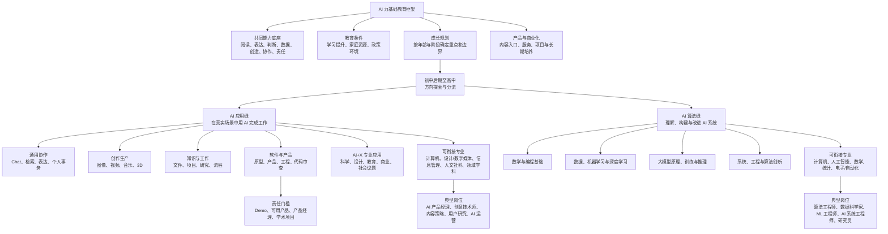

# AI 力基础教育框架（讨论稿 0.3）

> **已被 0.4 更新**：本文件保留为方法论与素材底稿。课程与产品的当前口径以《AI力基础教育框架（讨论稿0.4-双阶段产品体系版）》为准；若两者冲突，以 0.4 为准。

> 本版用于确定总框架与章节关系，不追求把每个章节一次写满。后续课程、内容号、家长产品、学生项目和政策观察，都可以从这个框架中各自展开。

## 目录

### 第一部分：方法论概览

1. [核心命题：什么是 AI 力](#1-核心命题什么是-ai-力)
2. [教育对象与目标：为什么分应用线与算法线](#2-教育对象与目标为什么分应用线与算法线)
3. [教育原则：什么先学，什么不能被替代](#3-教育原则什么先学什么不能被替代)
4. [共同能力底座：所有路径共享什么](#4-共同能力底座所有路径共享什么)
5. [总地图：阶段、方向、场景与责任如何连接](#5-总地图阶段方向场景与责任如何连接)

### 第二部分：成长规划

6. [年龄与阶段：不同阶段的重点和边界](#6-年龄与阶段不同阶段的重点和边界)
7. [每个阶段如何展开：目标、场景、练习与证据](#7-每个阶段如何展开目标场景练习与证据)
8. [初中后期至高中的方向展开](#8-初中后期至高中的方向展开)
   - 8.1 分流前提：何时引入应用与算法方向
   - 8.2 AI 应用线：从协作到专业应用
   - 8.3 AI 算法线：从计算思维到研究与工程
   - 8.4 AI 与升学价值：从奖项包装转向证据组合

### 第三部分：AI 与当前教育条件

9. [AI 与学习提升：怎样帮助学习而不替代学习](#9-ai-与学习提升怎样帮助学习而不替代学习)
10. [AI 与家庭资源：不同资源条件下的培养建议](#10-ai-与家庭资源不同资源条件下的培养建议)
11. [AI 与教育环境：政策、学校与社会变化如何解读](#11-ai-与教育环境政策学校与社会变化如何解读)

### 第四部分：产品与商业化

12. [内容入口：AI 教育观、AI 实战派与 AI 现场观察](#12-内容入口-ai-教育观ai-实战派与-ai-现场观察)
13. [课程、服务、项目与评价：如何把框架变成产品](#13-课程服务项目与评价如何把框架变成产品)
14. [产品与商业化：从内容入口到长期培养](#14-产品与商业化从内容入口到长期培养)

---

## 第一部分：方法论概览

### 1. 核心命题：什么是 AI 力

AI 力不是会几个工具，也不是能让模型输出一段文字、一张图或一段代码。

> AI 力，是人在具体场景中理解问题、表达需求、调用合适的 AI、验证过程与结果，并对结果承担相应责任的能力。

这个定义把关注点从“工具熟练度”转到四件事：

- **场景**：在学习、创作、研究、工作还是产品开发中使用？
- **判断**：这个问题是否值得交给 AI，输出是否可信？
- **过程**：人和 AI 分别做什么，如何迭代与核验？
- **责任**：只是帮助自己完成任务，还是要让用户、团队或研究共同体依赖结果？

这一章后续可展开为：AI 力与数字素养、信息素养、编程能力、AI 素养的区别；以及不同年龄段对“负责”的不同理解。

### 2. 教育对象与目标：为什么分应用线与算法线

AI 教育至少面对两类不同的长期目标。

| 主线 | 要培养什么 | 典型去向 |
|---|---|---|
| AI 应用线 | 用 AI 解决学习、创作、协作、产品和行业问题的人 | AI+学科、创意、产品、运营、研究应用 |
| AI 算法线 | 理解、构建、改进或部署 AI 系统的人 | 数据、机器学习、模型、软件与 AI 工程、研究 |

两条线不是高低之分，也不是从小学就必须二选一。应用线的人也要有数据、评测和系统边界意识；算法线的人也必须理解真实问题、用户、社会影响和伦理。

这一章后续可展开为：不同学生适合哪条线、可否转换、不同专业与工作如何落在两条线之间。

### 2.1 场景化分层：同一工具，不同目标与深度

AI 学习不应从“学哪个工具”开始，而应从真实场景、目标和责任开始。同一个模型可以用于聊天、学习、创作、项目协作、产品开发或算法研究，但学习深度完全不同：

| 层级 | 典型场景 | 需要形成的能力证据 |
|---|---|---|
| 基础调用 | 聊天、检索、个人事务与简单生成 | 能表达需求、识别边界并核验基本事实 |
| 场景协作 | 学习、创作、文件管理、项目梳理与工作辅助 Copilot | 能拆任务、管理过程、保留记录并复盘结果 |
| 专业应用 | 视频分镜、音乐制作、产品设计、AI 编程与研究项目 | 能使用领域方法，完成从规划到交付的工作流 |
| 系统与算法 | 数据库与系统设计、代码审查、模型训练、推理与部署 | 能理解技术原理、评测风险，并承担用户、团队或研究责任 |

教育产品的任务不是把所有工具教一遍，而是告诉学习者在自己的目标下需要了解什么、练习什么、做到什么程度。

### 3. 教育原则：什么先学，什么不能被替代

1. **先成人，后工具。** 语言、阅读、专注、现实社交和责任感，不能让 AI 代替建立。
2. **先场景，后技巧。** 不脱离任务讲“万能提示词”；先问要解决什么，再讨论用法。
3. **先问题，后项目。** 项目应回应真实观察，而非为作品集拼一个 AI 外壳。
4. **先证据，后包装。** 过程记录、来源、版本、测试、反馈和反思，比最终成品更能说明能力。
5. **责任随能力升级。** 做个人 Demo、做可用产品、做研究和做工程系统，需要完全不同的标准。
6. **以终为始设计学习。** 先判断学习者要解决的是个人问题、专业任务、产品交付还是算法研究，再反推所需的资源、练习、功能认知和评价标准。
6. **AI 用来放大人，而不是绕开成长。** AI 可以帮助解释、反馈、协作和创造，但不应成为代写、情感替代或逃避思考的工具。

这一章后续可展开为：低龄边界、作业规范、研究诚信、版权隐私和家庭 AI 公约。

### 4. 共同能力底座：所有路径共享什么

无论学生后来走 AI 应用还是算法，都需要一套共同底座：

| 能力 | 为什么重要 |
|---|---|
| 阅读与信息提取 | 找到可靠资料，理解上下文和限制条件 |
| 清晰表达 | 把模糊想法变成目标、约束和验收标准 |
| 逻辑与证据意识 | 区分事实、推测、观点，核验 AI 输出 |
| 问题意识 | 从生活、学科和社会观察中发现值得解决的问题 |
| 数据敏感度 | 理解数据来源、偏差、隐私与结论边界 |
| 审美与创造力 | 对创作质量、表达和选择形成自己的判断 |
| 协作与自我管理 | 管理文件、任务、反馈、版本和承诺 |
| 伦理与责任感 | 对版权、隐私、偏见、安全和现实影响负责 |

这一章的作用是防止 AI 教育沦为工具培训。它也应成为家长、学校和课程共同使用的评价语言。

### 5. 总地图：阶段、方向、场景与责任如何连接

这套框架不是一条所有人必须走完的直线，而是四个维度的组合：

| 维度 | 回答的问题 |
|---|---|
| 阶段 | 这个年龄和人生阶段，最该发展什么？ |
| 方向 | 更适合先走应用、算法，还是暂不分流？ |
| 场景 | 在学习、创作、协作、产品、研究中的哪个问题里练？ |
| 责任 | 只需自己使用，还是要对用户、数据、团队和结论负责？ |

同一位学生可以在不同场景处于不同层次：一名视频创作者可以在 AI 创作上走得很深，但在编程上只需具备基础协作能力；一名算法方向学生也可能还没有足够的产品或用户意识。这张地图的目的，是帮助学生做有选择的深入，而不是要求人人全能。

## 第二部分：成长规划

### 6. 年龄与阶段：不同阶段的重点和边界

| 阶段 | 核心任务 | AI 教育重点 | 主要边界 |
|---|---|---|---|
| 学前—小学中低年级 | 建立语言、阅读、规则、现实体验与社交 | 家长教育、家庭规则、基础认知 | 不把 AI 当陪伴或代写工具；不把“做 App”当成果 |
| 小学高年级—初中前期 | 建立学习习惯、信息辨识、表达和基础计算思维 | 有限场景下的 AI 协作、基础编程、核验习惯 | 不把 AI 当答案机；不以炫技压过基础学力 |
| 初中后期 | 连接学科兴趣、创作与真实问题 | 学科应用、项目尝试、方向探索 | 不为了作品集硬做项目；不过早把一次兴趣定成职业 |
| 高中 | 形成相对明确的方向与能力证据 | 应用/算法分流、研究、产品、竞赛、作品集 | 不伪造研究、包装奖项或忽略学术基础 |
| 大学前后 | 形成可进入真实世界的工作能力 | AI 工作流、跨学科研究、产品/工程、职业实践 | 不只会调用模型而无法验证、协作和交付 |

这里的阶段不是机械的年龄表，而是判断“当前该补什么”的坐标。基础能力不足时，应优先补底座；兴趣和能力已经成熟时，可以提前进入探索。

### 7. 每个阶段如何展开：目标、场景、练习与证据

后续展开任何一个年龄段，都建议沿用同一张模板：

1. **这一阶段的核心发展任务**：例如小学阶段是阅读、表达、规则和现实体验。
2. **AI 可进入的有限场景**：例如错题复盘、资料整理或亲子创作，而不是全时陪伴。
3. **人必须完成的动作**：先尝试、自己解释、核验来源、保留草稿、现实协作。
4. **可练习的任务**：不追求大项目，而是设计适龄的小任务与反思。
5. **可证明的证据**：任务记录、复盘、作品过程、代码版本、调研或反馈。
6. **需要避免的风险**：依赖、隐私泄露、代写、情感替代、过度屏幕使用等。

这样，年龄规划不会停在“哪个年级学什么工具”，而能成为每个阶段可独立展开的课程与家长指南。

### 8. 初中后期至高中的方向展开

#### 8.1 分流前提：何时引入应用与算法方向

初中后期至高中，学生开始具备更稳定的学科兴趣、抽象能力和持续完成项目的可能性，此时可以引入方向探索。这里的“分流”应理解为尝试性选择，而非一次定终身。

进入方向探索前，应先判断四件事：

- 学生是否已有相对稳定的兴趣场景，例如创作、科学、商业、产品、数据或编程；
- 是否具备基本的阅读、表达、逻辑、信息核验和自主学习能力；
- 更享受解决真实应用问题，还是更愿意理解模型、数据和技术原理；
- 是否愿意投入较长时间处理难题、反复调试和接受失败。

分流后的共同要求仍是：学科基础不能丢，真实问题不能丢，伦理与责任不能丢。

#### 8.2 AI 应用线：在真实场景中用 AI 完成工作

应用线的核心不是“学会某个工具”，而是在特定场景中，和 AI 一起做出可靠、有价值的结果。它首先按**应用场景**划分，而非按工具划分。

| 应用场景 | 核心问题 | 典型内容 | 可延展的方向 |
|---|---|---|---|
| 通用协作 | 怎样把 AI 用作日常思考与行动的助手？ | Chat、检索、表达、个人事务、信息核验 | 学习助手、个人效率、沟通表达 |
| 创作生产 | 怎样将想法变成完整的多模态作品？ | 图像、视频、音乐、3D、分镜、编辑、版权 | 设计、影视、动画、游戏、创意技术 |
| 知识与工作 | 怎样管理复杂信息和多步骤协作？ | 文件、笔记、知识库、项目、研究、流程、自动化 | 项目管理、研究助理、团队协作、运营 |
| 软件与产品 | 怎样把需求变成可验证、可使用的系统？ | 原型、AI 编程、数据库、产品、测试、部署、代码 review | AI 产品、软件工程、解决方案、创业 |
| AI+X 专业应用 | 怎样将 AI 放入一个学科或行业问题中？ | AI+科学、教育、商业、社会议题、医疗、设计等 | 跨学科研究和行业应用 |

##### 8.2.1 软件与产品：从 Demo 到可交付产品的责任与技术门槛

“软件与产品”是应用线中的一个场景，不应被抽成与应用、算法并列的路径。下面将结果责任与相应技术要求放在同一张表中：

| 目标 | 结果责任 | 技术与核验能力 | 不应误认为已经具备的能力 |
|---|---|---|---|
| 做个人 Demo | 对自己能否跑通和演示负责 | 能拆页面与流程，并用 AI 生成、运行和调试基础代码；会使用托管数据服务，理解表、字段和基础权限；能运行测试、看懂报错 | 不等于能维护真实产品 |
| 做可给他人使用的产品 | 对用户体验、基本安全与持续迭代负责 | 能写需求、用户流程和验收标准；能规划核心实体、关系、权限、备份与成本；能检查异常处理、可维护性和测试覆盖 | 不等于全量软件工程能力 |
| 做产品经理 | 对需求判断、可行性、成本和风险负责 | 能理解实现边界并与 AI/工程协作；能画数据流，理解数据库、接口、权限和隐私；能依据需求、边界条件和用户体验提出 review | 不必成为全栈开发者 |
| 做学术项目 | 对方法、数据、实验记录和结论边界负责 | 能复现基础代码、处理数据、记录实验；按研究规模管理数据与版本；能核验方法、实验设计和结论是否被代码与数据支持 | 不等于用 AI 生成一篇研究报告 |
| 走算法 / 工程专业 | 对系统正确性、性能、安全和长期维护负责 | 能独立实现、调试、优化并阅读较复杂代码；能设计数据库、服务接口、数据管道和部署；能从正确性、性能、安全、可读性、测试等维度 review | 不等于只会调用模型 API |

##### 8.2.2 应用线的专业与岗位延伸

应用线的“专业”和“岗位”应分两层理解。专业决定学生要补哪些学科与方法，岗位则是未来在真实组织中承担什么工作；二者不是一一对应的。

| 应用场景 | 可衔接专业 | 典型岗位 |
|---|---|---|
| 创作生产 | 视觉传达、数字媒体艺术、影视/动画、游戏设计、交互设计 | AI 设计师、创意技术师、数字内容制作人、交互设计师 |
| 知识与工作 | 信息管理、商业分析、教育技术、公共管理、相关领域学科 | AI 自动化运营、知识管理/研究助理、项目经理、解决方案顾问 |
| 软件与产品 | 计算机、软件工程、信息管理、交互设计、商业分析 | AI 产品经理、产品运营、解决方案架构师、软件工程师 |
| AI+人文社会应用 | 中文、外语、历史、哲学、社会学、人类学、新闻传播、教育学、心理学、法学 | 内容策略/编辑、用户研究员、AI 伦理与治理专员、教育产品经理、计算人文研究助理 |
| AI+X 专业应用 | 生物、化学、材料、医学、教育、金融、法律、环境等具体领域 | 领域数据分析师、计算研究助理、AI 应用顾问、行业产品经理 |

选择应用线时，先从学生愿意长期投入的场景和领域出发，再补足所需的专业基础；不要只因为某个岗位名称热门，就倒推一套空心项目。

#### 8.3 AI 算法线：理解、构建与改进 AI 系统

算法线的核心是理解 AI 系统如何从数据、模型、训练和工程中运作，并逐步具备构建、评估和改进它们的能力。它既有清晰的基础顺序，也有后期可以分叉的技术方向。

| 技术板块 | 要回答的问题 | 核心内容 | 适合继续走向 |
|---|---|---|---|
| 数学与编程基础 | 怎样把问题表达成可执行的规则、数据与程序？ | Python、数据结构与算法、线性代数、概率统计、微积分、软件基础 | 计算机、数据、AI 的共同基础 |
| 数据、机器学习与深度学习 | 模型如何从数据中学习，如何判断它是否真的有效？ | 数据清洗、可视化、统计、分类、回归、训练/测试、指标、过拟合、神经网络 | 数据科学、机器学习、应用研究 |
| 大模型原理、训练与推理 | 大模型如何表示语言和多模态信息，如何被训练、对齐与调用？ | Transformer、Token、预训练、微调、RAG、评测、推理、Agent、数据与安全 | 大模型应用、模型工程、模型研究 |
| 系统、工程与算法创新 | 如何让模型在真实世界稳定、高效、安全地工作，或提出新的方法？ | 分布式训练、推理优化、服务部署、评估体系、论文复现、实验设计、算法创新 | ML 工程、AI 系统、研究与前沿算法 |

算法线可以按“基础 → 学习 → 模型 → 系统/研究”的顺序理解，但不应被误解成必须学完所有内容才能做项目。学生可在学完基础编程和数据理解后参与小型应用或复现实验；只是随着目标从“能跑通”变成“能解释、优化和创新”，数学、工程和研究方法的要求会迅速提高。

算法线的每一板块都需要同时建立三种能力：

- **实现能力**：能写、读、调试和维护代码；
- **实验能力**：能提出假设、处理数据、选择指标、解释结果；
- **系统与责任意识**：能理解数据版权、偏差、安全、成本和真实部署的限制。

这样，算法教育不会变成“跑一个 notebook”或“背几个模型名”，而会逐步通向可靠的工程与研究能力。

##### 8.3.1 算法线的专业与岗位延伸

算法线对数学、代码、实验和工程训练的要求更高。专业选择更集中，岗位也更依赖实际项目与技术深度。

| 技术板块 | 可衔接专业 | 典型岗位 |
|---|---|---|
| 数学与编程基础 | 计算机科学、软件工程、数学、统计、信息科学 | 软件工程师、数据工程师、量化/数据分析师 |
| 数据、机器学习与深度学习 | 人工智能、计算机科学、统计、数据科学、应用数学 | 算法工程师、数据科学家、机器学习工程师、应用研究员 |
| 大模型原理、训练与推理 | 人工智能、计算机科学、自然语言处理、计算语言学 | 大模型工程师、模型评测工程师、推理优化工程师、研究工程师 |
| 系统、工程与算法创新 | 计算机系统、人工智能、电子/自动化、机器人 | ML 平台工程师、AI 系统工程师、机器人算法工程师、研究员 |

这些岗位会持续变化，但判断标准相对稳定：能否把数学和代码变成可靠实验，能否把模型变成稳定系统，以及能否对数据、性能、安全和结果负责。

#### 8.4 AI 与升学价值：从奖项包装转向证据组合

AI 项目不能只作为热门标签，应服务于学生的长期学术身份。

##### 美本方向

重点不是堆砌证书或“我用 AI 做了一个东西”，而是形成可被看见的个人问题意识：

- 我长期关心什么问题；
- 为什么这个问题与我的经历、社区或学科兴趣有关；
- 我如何观察、研究、尝试和失败；
- AI 在其中承担什么作用，哪些部分仍由我完成；
- 项目产生了什么真实反馈或影响。

适合的成果是：持续项目、研究日志、用户反馈、作品迭代、公开表达、跨学科连接，而不是一次性“包装项目”。

##### 英国及其他偏学术申请方向

重点是学术相关性、学科能力与可核验成果。奖项、竞赛、研究项目、课程成绩和标准化考试更容易成为外部证据，但仍应优先看目标学校和专业的具体要求。

##### 国内及综合路径

更适合建立“学科基础 + 科创/竞赛 + 长期项目 + 可解释成果”的组合。具体竞赛与政策的有效性必须按当年、当地、目标学校核验，避免把非官方证书包装成升学背书。

## 第三部分：AI 与当前教育条件

### 9. AI 与学习提升：怎样帮助学习而不替代学习

本章讨论 AI 如何针对不同学生的特性，改善其学习过程。它服务于所有学生，并不以是否已选择应用或算法方向为前提。

重点不是直接给答案，而是用 AI 暴露理解缺口、提供反馈、组织练习与复盘。每一项学习场景都要说清 AI 可以做什么、学生必须亲自完成什么、家长如何判断是否形成了真实理解。

### 10. AI 与家庭资源：不同资源条件下的培养建议

不同地区与家庭的时间、设备、语言环境、学校资源和家长陪伴能力差异很大，不能将某一种高投入路径写成普遍标准。四五线城市家庭尤其应优先建立低成本、可持续、可验证的学习环境：

- 先保住阅读、写作、数学、英语、科学探究和基本编程等基础学力；
- 善用公共资源、学校社团、图书馆、科技馆和开源社区；
- 从本地真实问题出发做项目，而非购买空泛的作品集项目；
- 长期保存阅读、调研、代码、版本和失败记录；
- 在高年级、方向较明确后，再寻找能提供真实反馈的导师或社群。

### 11. AI 与教育环境：政策、学校与社会变化如何解读

政策、新工具和学校动作变化很快，但它们不应被原样搬运给家长。本章的功能是建立一套“教育翻译”方法：

- 政策或学校动作具体说了什么，覆盖谁，是否已经落地？
- 它改变的是课程、评价、资源获取，还是只是试点口号？
- 对不同年龄、地区和目标的家庭有什么实际意义？
- 家庭现在需要行动，还是继续观察？

可持续观察的对象包括：中小学 AI 教育政策、大学专业与招生要求、区域资源、模型与工具变化、行业岗位变化、版权隐私与未成年人保护规则。

## 第四部分：产品与商业化

### 12. 内容入口：AI 教育观、AI 实战派与 AI 现场观察

内容入口不是工具清单，而是帮助家庭建立 AI 判断、识别真实问题并找到下一步的独立内容产品。建议形成三条互相支撑的内容线：

| 内容线 | 核心问题 | 典型内容 |
|---|---|---|
| AI 教育观 | 什么值得学，什么不必急？ | AI 力、年龄边界、家庭规则、学习价值、应用与算法方向 |
| AI 实战派 | AI 如何进入真实场景？ | 学习、创作、文件、项目、产品、编程中的方法、过程与核验 |
| AI 现场观察 | 外部变化对家庭意味着什么？ | 模型、政策、学校、行业、专业与岗位变化的教育翻译 |

每条内容都应尽量回答：适合谁、解决什么场景、需要什么基础、如何验证结果、下一步是什么。内容的核心指标不是追逐热点，而是降低家庭决策成本，让读者找到适合自己年龄、目标与资源的路径。

内容与产品遵循同一条原则：场景先于工具，目标先于技巧，过程先于成品，责任随深度升级。

### 13. 课程、服务、项目与评价：如何把框架变成产品

这套框架可以服务于三种不同的工作，而不必急于把它们混成一个产品：

| 使用场景 | 框架的作用 |
|---|---|
| 家长沟通与内容号 | 帮家庭理解年龄边界、使用原则和下一步选择 |
| 课程与项目设计 | 为每个课程标明适用人群、场景、能力目标、练习、风险和交付 |
| 学生诊断与长期培养 | 判断学生的共同底座、兴趣方向、能力层级和下一阶段任务 |

### 14. 产品与商业化：从内容入口到长期培养

商业化不应脱离教育判断。内容的作用是帮助家长和学生看清问题，产品的作用是提供练习、反馈与可验证的交付。建议按“内容入口 → 轻量服务 → 项目制培养 → 高阶探索”的节奏发展：

每个产品在设计前先回答四个问题：

- **场景**：用户正在解决聊天、学习、创作、文件、项目、产品、研究还是算法工程问题？
- **深度**：只需会调用，还是要完成工作流、规划数据库、Review 代码，或承担系统与研究责任？
- **资源**：家庭已有的设备、时间、语言、导师和本地资源是什么？低资源家庭能否从同一产品开始？
- **证据**：最终留下判断记录、过程日志、作品、原型、代码、实验，还是可复现的项目成果？

| 层级 | 核心人群 | 典型产品 | 主要交付 |
|---|---|---|---|
| 内容入口 | 家长、学生与教育者 | AI 教育观、AI 实战、AI 观察 | 判断框架、案例与可复用方法 |
| 轻量服务 | 低龄家庭、初高中学生 | 家庭 AI 公约工作坊、AI 学习工作坊 | 家庭使用规则；学习场景中的 AI 使用与复盘框架 |
| 项目制培养 | 有明确兴趣的初高中学生 | AI+专业探索、创作/产品短项目 | 方向判断、过程记录、作品或原型 |
| 高阶探索 | 明确走 AI、CS 或 AI+科学方向的学生 | AI+X 研究、科创/竞赛、算法与工程进阶 | 可复现实验、研究/工程项目、长期能力档案 |

低龄阶段不应急于向学生销售“AI 技能课”，而应优先服务家长：帮助家庭建立设备、时间、隐私、作业与情感陪伴的 AI 公约。后续是否开展学校或机构合作，应建立在已验证的课程、师资与评价标准之上，而不是只以证书或热点包装为卖点。

这份 0.3 版先完成“树干”。后续可以按需要展开成独立文件：

1. 《不同年龄段的 AI 教育规划》：展开第 6、7 章。
2. 《高中阶段 AI 应用与算法方向地图》：展开第 8 章。
3. 《AI 如何提升学习，而不替代学习》：展开第 9 章。
4. 《AI 与专业、职业、升学》：沿第 8.2—8.4 节展开。
5. 《不同资源条件下的家庭 AI 培养建议》：展开第 10 章。
6. 《AI 教育政策与学校趋势观察框架》：展开第 11 章。

这样总框架负责保持判断一致，专题文件负责提供具体做法；以后增加内容时，也不需要反复改动总框架的层级。
