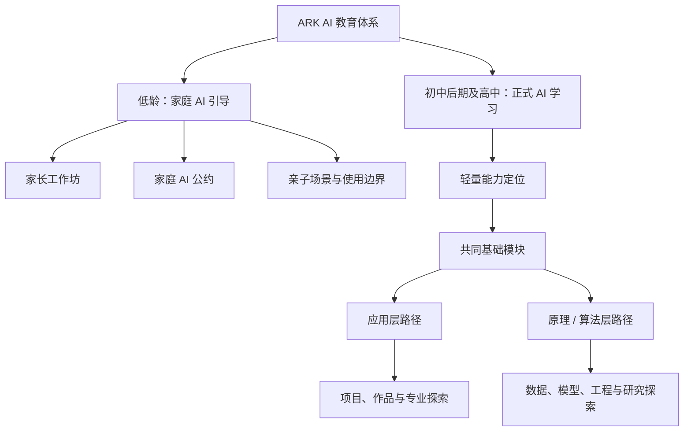

# AI 力基础教育框架（讨论稿 0.4｜双阶段产品体系版）

> **已被 0.5 更新**：本文件保留为过渡版本。课程与产品的当前口径以《AI力基础教育框架（讨论稿0.5-LKFJ分层课程体系版）》为准；若两者冲突，以 0.5 为准。

> **版本定位**：本版以 2026 年 7 月 23 日讨论及后续确认的产品思路为准。若与 0.2、0.3 或其他旧材料冲突，均以本版为准。
>
> **核心变化**：课程体系明确分为“低龄家庭引导”与“初中后期及高中正式学习”两部分；正式学习以“应用层 + 原理/算法层”为骨架，以模块化课程、能力定位和目标导向的路径建议为交付。

## 1. 一句话定位

ARK 面向未来 AI 世界，帮助家庭和学生在合适的阶段学合适的内容：低龄先建立人、家庭与 AI 的健康关系；初中后期起，再将兴趣、基础和目标转化为可验证的 AI 学习路径。

我们不卖“快速学会一个工具”，也不把“一句话做出 App”当作 AI 能力。真正的 AI 力，是在具体场景中理解问题、做出判断、与 AI 协作、验证结果，并对过程和结果负责的能力。

## 2. 总体架构：两个阶段，一套能力地图

| 阶段 | 主要服务对象 | 核心问题 | 主要产品形态 | 不做什么 |
|---|---|---|---|---|
| **低龄阶段：家庭 AI 引导** | 初中后期之前的家长与家庭 | 孩子如何在不被 AI 替代成长的前提下接触和使用 AI？ | 家长工作坊、家庭诊断、家庭 AI 公约、主题讲座 | 不把孩子送进长期工具培训；不以“AI 小创客”包装替代基础能力 |
| **正式学习阶段：AI 学习体系** | 初中后期及高中学生，家长共同参与决策 | 这个学生现在适合从哪里开始；走应用、原理/算法，还是组合学习；下一步学什么？ | 能力定位、模块课程、短项目、长期项目、导师服务 | 不用年龄或热点替代能力判断；不把一次项目包装成长期能力 |

年龄是重要参考，而不是机械分界。初中后期之前，教育重点始终是阅读、表达、专注、现实经验、学科基础与自我管理；具备更强抽象能力、稳定兴趣和自主学习准备的学生，可在家长共同判断下提前进入少量探索模块。

## 3. 低龄阶段：先帮助家长，而不是急着教孩子“学 AI”

### 3.1 核心判断

在初中后期之前，孩子最需要积累的仍是基础学力与人的能力：语言和阅读、数感与逻辑、注意力、现实体验、社交、审美、好奇心、独立表达与责任感。AI 可以成为有限场景中的辅助工具，但不应替代这些能力的形成。

因此，这一阶段的主要客户和学习者是家长。ARK 的角色不是告诉家长“越早上 AI 课越好”，而是帮助他们做出不过度、不过早、不失控的判断。

### 3.2 家长工作坊的四个主题

| 工作坊 | 要解决的问题 | 家长带走的交付 |
|---|---|---|
| **认识 AI：能力、局限与风险** | AI 会什么、不会什么；为什么“像懂了”不等于真的可靠 | 家庭可用的 AI 基本认知与核验清单 |
| **家庭使用边界** | 屏幕时间、账号、隐私、作业、创作与情感陪伴如何设边界 | 可执行的《家庭 AI 公约》 |
| **引导孩子正确相处** | 如何把 AI 用在提问、复盘、解释和亲子创作，而非代答与依赖 | 适龄场景卡与亲子对话方法 |
| **为正式学习做准备** | 现在该补什么基础；何时可以进入更系统的 AI 学习 | 孩子的准备度观察表与下一阶段建议 |

### 3.3 家庭 AI 公约：最低可执行版本

家庭 AI 公约不追求复杂，而应写清以下六件事：

1. 哪些设备、账号和信息可以使用，哪些个人信息绝不输入；
2. 每种使用场景的时间与陪伴规则；
3. 作业中哪些步骤必须由孩子先独立完成；
4. AI 可以帮助解释、提问和反馈，但不能直接代写、代答或伪造过程；
5. 重要事实、图片、引用和结论如何核验；
6. 当孩子感到焦虑、孤独或困惑时，优先找真实的人，而不是把 AI 当情感替代。

### 3.4 低龄阶段的边界

- 不以“孩子会用多少 AI 工具”评价成长；
- 不用生成作品取代孩子的阅读、手写、表达、动手和现实协作；
- 不用成人脚本包装儿童项目或公开表达；
- 不把聊天机器人当陪伴者、权威答案或隐私容器；
- 不因家长焦虑而提前进入高强度编程、模型训练或作品集项目。

## 4. 正式学习阶段：从“现在适合学什么”开始

### 4.1 学习体系的任务

初中后期及高中，学生逐渐具备将兴趣、学科与真实问题连起来的能力。正式体系不是一张所有人都要学完的课表，而是要持续回答五个问题：

1. 学生目前的基础、兴趣和学习方式是什么？
2. 他/她现在最适合补的能力是什么？
3. 目标更偏向 AI 应用、产品与跨学科问题，还是模型、数据与算法？
4. 在 ARK 的整体产品中，当前处于哪个位置，下一步有哪些合理选择？
5. 什么过程与成果可以证明这一步真的学会了？

### 4.2 入口：轻量 AI 能力定位

定位评测的目的不是给学生贴标签、预测职业或替代学校考试，而是形成一次可讨论、可更新的起点判断。它应由简短自述、情境任务、已有作品/学习记录和访谈构成。

| 观察维度 | 关注什么 | 可能的建议 |
|---|---|---|
| 学习与表达基础 | 阅读、逻辑、清晰表达、信息核验、自主学习 | 先补共同基础，或进入基础应用模块 |
| 数字与计算基础 | 文件管理、基础编程、数据意识、调试耐心 | 进入计算与数据基础，或以应用任务带动补齐 |
| AI 协作习惯 | 是否会定义任务、补充上下文、核验输出、记录过程 | 从负责任的 AI 协作与工作流开始 |
| 兴趣与问题场景 | 创作、学科研究、产品、社会议题、数据或工程 | 匹配应用项目与领域模块 |
| 原理/算法准备度 | 对数学、编程、数据、实验和反复调试的兴趣与基础 | 选择原理/算法的入门深度，而非强行分流 |
| 发展目标与资源 | 升学、专业探索、长期项目、时间与家庭支持 | 确定模块组合、节奏和服务方式 |

**输出形式**：一页能力画像 + 当前推荐模块 + 暂不建议投入的方向 + 6—12 个月学习路径。评测结论应随学生成长、课程表现和目标变化复盘，而不是一次定论。

## 5. 正式学习的共同骨架：六个模块

六个模块不是按工具切分，而是构成所有正式学习者可按需组合的能力单元。每个模块可做成入门工作坊、系列课程、短项目或长期指导；学生不必一次全部完成。

| 模块 | 要解决的能力问题 | 核心内容 | 典型交付 |
|---|---|---|---|
| **M1 AI 通识与负责任协作** | AI 能做什么、会错在哪里，如何与它协作而不失去判断？ | 基本原理、提示与上下文、事实核验、版权、隐私、偏见、学习诚信 | 一份带来源和复盘的 AI 协作任务记录 |
| **M2 数据、统计与证据** | 数据从哪里来，结论为何可信，AI 如何从数据中学习？ | 数据结构、采样与偏差、描述统计、可视化、概率直觉、指标与结论边界 | 一份可解释的数据分析或研究证据卡 |
| **M3 表达、创作与多模态叙事** | 如何把自己的观察与判断转化为高质量表达，而不是生成堆砌？ | 写作、视觉、图像/视频/音频、分镜、编辑、风格、版权与反馈 | 有明确创作意图、过程记录和修改依据的作品 |
| **M4 问题定义、产品设计与原型** | 如何从真实需求出发，设计可验证的解决方案？ | 用户观察、问题定义、需求拆解、用户流程、交互原型、测试、迭代、数据与权限意识 | 经过用户反馈的产品方案或可交互原型 |
| **M5 计算、编程与 AI 工作流** | 如何把任务变成可执行流程，并能读、改、测和调试 AI 协作生成的代码？ | Python/脚本、GitHub 与版本意识、AI 编程、自动化、接口、数据库基础、测试与 code review 入门 | 可运行且能解释边界的程序、自动化流程或 Demo |
| **M6 AI 原理、模型与系统** | AI 系统如何从数据、模型、训练、评测到部署运作？ | 机器学习、神经网络、Transformer、训练/测试、RAG、微调概念、评测、推理、安全与成本 | 可复现实验、模型评测报告或简单系统说明 |

### 模块使用原则

- **M1 与 M2 是共同底座**：所有方向都要具备基本的判断、数据与证据意识。
- **M3、M4、M5 是应用层的主要抓手**：分别对应创作、产品与可执行工作流。
- **M2、M5、M6 是原理/算法层的主要抓手**：统计和编程不是附属技能，而是理解、实验和工程的共同语言。
- **模块允许交叉组合**：例如历史研究学生可先学 M1 + M2 + M5，再选择 M6 的基础实验；产品方向学生可重点学习 M1 + M4 + M5，并补足 M2 的数据与评测。

## 6. 两条正式学习路径：应用层与原理/算法层

两条路径不是高低之分，也不是从初中开始必须二选一。它们共享基础、可以互相进入，并应根据学生目标组合深度。

### 6.1 应用层：在真实场景中把 AI 变成可靠的能力

应用层培养的是能够使用 AI 完成学习、创作、研究、协作、产品或行业任务的人。重点不在“会调用”，而在问题定义、工作流、质量判断与交付责任。

| 应用方向 | 主要模块组合 | 典型问题 | 可形成的证据 |
|---|---|---|---|
| 学习与研究协作 | M1 + M2 + M5 | 如何检索、整理、分析并表达一个学科问题？ | 研究过程、资料依据、数据或论证边界 |
| 创作与内容表达 | M1 + M3 + M4 | 如何把观察变成有作者性的多模态作品？ | 创作意图、版本、版权说明、反馈与修改 |
| AI 产品与创业探索 | M1 + M2 + M4 + M5 | 如何把真实需求变成可测试的产品？ | 用户研究、原型、测试记录、Demo 与复盘 |
| AI+X 跨学科应用 | M1 + M2 + M4，按需加入 M3/M5/M6 | 如何用 AI 改善科学、人文、教育、商业或社会问题？ | 学科问题、方法选择、过程、结论与局限 |

应用层的递进可分为：

1. **会协作**：能定义任务、补上下文、核验输出；
2. **会设计工作流**：能拆解多步骤任务、管理资料和版本；
3. **会做项目**：能围绕真实问题形成作品、原型或研究尝试；
4. **能承担专业应用责任**：能解释方法、数据、限制、用户影响与迭代逻辑。

### 6.2 原理/算法层：理解、构建与评估 AI 系统

原理/算法层培养的是愿意进一步理解数据、模型、训练、评测和工程系统的学生。这里的“算法”不是只背模型名，也不是只跑一次 notebook；它要求逐步形成数学、编程、实验和工程责任。

| 进阶层次 | 主要模块组合 | 学习重点 | 可形成的证据 |
|---|---|---|---|
| 原理入门 | M1 + M2 + M5 | 用代码和数据理解 AI 如何工作；建立统计与实验直觉 | 可解释的小程序、数据任务或实验记录 |
| 机器学习与评测 | M2 + M5 + M6 | 数据清洗、分类/回归、训练测试、指标、过拟合与偏差 | 可复现实验及评测报告 |
| 模型与系统探索 | M2 + M5 + M6，按需加入 M4 | 大模型、RAG、微调概念、评测、推理、部署与安全 | 简单系统、技术说明、测试和风险复盘 |
| 研究/工程进阶 | M2 + M5 + M6 深入学习 | 论文复现、实验设计、系统优化或领域研究 | 可审查的代码、数据、实验日志和结论边界 |

原理/算法层需要更高强度的数学、代码和调试投入。学生可以先在应用层完成项目，再转入原理学习；也可以在算法层入门后，用应用场景检验自己对技术的理解。

## 7. 路径推荐：根据目标反推，而不是按热点推课

| 学生当前目标 | 起步建议 | 下一步可选 | 暂不应急于做的事 |
|---|---|---|---|
| 不知道 AI 应该学什么 | 定位评测 + M1 + M2 基础 | 根据兴趣进入 M3/M4/M5 或原理入门 | 直接报名长期算法营或作品集项目 |
| 想做创作、媒体、设计 | M1 + M3，补 M4 | 多模态项目、创意技术、交互原型 | 只追热点工具或把生成图当审美能力 |
| 想做产品、App 或创业 | M1 + M4 + M5，补 M2 | 用户测试、数据/权限、AI 产品项目 | 把能演示的页面当可交付产品 |
| 想做 AI+人文社科研究 | M1 + M2 + M5 | 语料/数据分析、数字人文、领域研究项目 | 因为是文科背景而跳过统计与方法训练 |
| 想走 CS、AI、数据或算法 | M2 + M5 + M6 入门 | 机器学习、评测、系统或研究进阶 | 只学 API 调用或只背理论不做实验 |
| 已有明确学科/竞赛/升学目标 | 定位评测 + 目标倒推模块组合 | 长期项目、导师反馈、证据档案 | 用 AI 伪造研究过程或包装奖项 |

## 8. 产品体系：从判断到服务的连续路径

| 产品层级 | 面向谁 | 解决什么问题 | 对应交付 |
|---|---|---|---|
| **内容与公开讲座** | 家长、学生、教育者 | 建立正确教育观，理解 AI 变化与行动边界 | 判断框架、案例、工具使用原则 |
| **家长工作坊** | 初中后期之前的家庭 | 建立家庭 AI 使用与成长引导方式 | 家庭 AI 公约、场景卡、准备度观察表 |
| **能力定位与路径咨询** | 初中后期及高中学生与家长 | 判断当前位置、学习重点和路线组合 | 能力画像、模块推荐、6—12 个月路径 |
| **模块化课程/短营** | 有明确起步需求的学生 | 补齐一个关键模块或验证一个兴趣方向 | 任务记录、作品/原型/实验、教师反馈 |
| **项目制学习** | 有方向与投入意愿的学生 | 将多个模块组合进真实问题和长期交付 | 项目档案、用户/数据/实验/版本证据 |
| **高阶导师与专业探索** | 目标明确的学生 | 连接 AI+专业、研究、产品、科创或长期发展 | 个性化学习方案与可审查成果 |

这套体系的商业逻辑不是“内容导向卖课”，而是让家长和学生先看清自己处于哪里，再提供相匹配的练习、反馈、项目与长期支持。专业探索只是其中一个模块或服务节点，不再承担全部产品叙事。

## 9. 评价原则：评价真实能力，而不是生成结果

所有课程和项目都应留下可回溯的证据。最低包括：

- 问题从何而来，学生自己的判断是什么；
- AI 在哪些环节参与，人保留了哪些关键决策；
- 使用了什么资料、数据或工具，如何核验；
- 有哪些版本、失败、反馈和修改；
- 最终成果能解决什么问题，仍有哪些局限；
- 学生能否用自己的语言解释过程与结果。

不同交付的责任门槛必须分清：能做 Demo，不等于能上线产品；能让模型跑通，不等于能做可靠研究；能生成一份漂亮内容，不等于形成表达、审美或判断能力。

## 10. 内容表达与品牌叙事

对外内容仍可沿用三条线，但每一条都服务于这套双阶段产品体系：

| 内容线 | 面向的核心问题 |
|---|---|
| **AI 教育观** | 家长如何理解不同阶段的培养重点、家庭边界与长期能力？ |
| **AI 实战派** | 学生在学习、创作、产品、数据和研究中，怎样真正把 AI 用起来并验证结果？ |
| **AI 现场观察** | 新模型、政策、学校、专业与行业变化，对不同年龄和目标的学生意味着什么？ |

每一篇内容尽量说明：适合谁、解决什么问题、需要什么前提、能如何验证、下一步可以进入哪一个工作坊、模块或服务。这样内容、课程、评测与长期培养使用同一张地图，而不是各讲各的。

## 11. 本版的明确取舍

1. **低龄阶段以家长工作坊为主**，不将学生 AI 技能课作为核心产品；
2. **初中后期及高中开始正式 AI 学习**，但以能力与准备度校准年龄，而非机械分级；
3. **正式体系采用“应用层 + 原理/算法层”**，共同底座与交叉组合优先于过早二选一；
4. **产品按模块组织**，可根据学生程度、目标与资源组合，不按单一工具或固定课包组织；
5. **能力定位是轻量、动态的教育诊断**，用于推荐下一步，不是标准化测评、职业预测或升学承诺；
6. **应用统计、产品设计、编程与数据意识纳入 AI 学习体系**，不把 AI 缩减成工具使用或纯算法训练；
7. **一切以过程证据为准**，拒绝用生成结果、成人脚本或短期包装替代真实成长。

## 12. 后续可拆分的产品文档

1. 《家长工作坊产品包》：四个工作坊的流程、案例、材料与家庭 AI 公约模板；
2. 《AI 能力定位工具包》：访谈提纲、情境任务、评分说明和路径报告模板；
3. 《六模块课程卡》：每个模块的适用人群、先修基础、课时、任务、证据与边界；
4. 《应用层路径地图》：创作、产品、AI+X 的模块组合和项目范式；
5. 《原理/算法层路径地图》：统计、编程、机器学习、模型与系统的递进要求；
6. 《项目评价与成长档案标准》：过程记录、作品、代码、数据、研究和反馈的证据模板。
